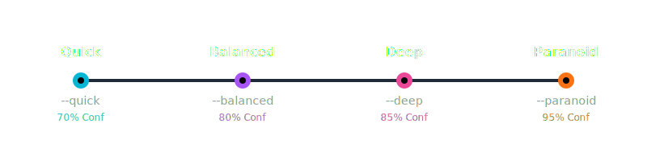
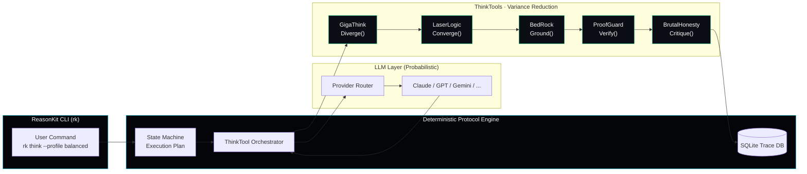

<div align="center">

# ReasonKit

## **The AI Reasoning Engine**

> _"Designed, not Dreamed."_ — From Prompt to Cognitive Engineering.

**Auditable Reasoning for Production AI | Rust-Native | Turn Prompts into Protocols**

<picture>
  <source media="(prefers-color-scheme: dark)" srcset="./brand/readme/reasonkit-core_tree_hero.png">
  <source media="(prefers-color-scheme: light)" srcset="./brand/readme/reasonkit-core_tree_hero.png">
  
</picture>

[](https://github.com/reasonkit/reasonkit-core/actions/workflows/ci.yml)
[](https://github.com/reasonkit/reasonkit-core/actions/workflows/security.yml)
[](https://crates.io/crates/reasonkit-core)
[](https://docs.rs/reasonkit-core)
[](https://crates.io/crates/reasonkit-core)
[](https://github.com/reasonkit/reasonkit-core/blob/main/LICENSE)
[](https://www.rust-lang.org/)
[](https://modelcontextprotocol.io)

[Website](https://reasonkit.sh) | [Pro](https://reasonkit.sh/pro/) | [Docs](https://docs.reasonkit.sh) | [Resources](https://reasonkit.sh/resources/) | [Enterprise](https://reasonkit.sh/enterprise/) | [About](https://reasonkit.sh/about/) | [GitHub](https://github.com/reasonkit/reasonkit-core)

</div>

---

## 🚀 Quick Install

<div align="center">

```bash
curl -fsSL https://get.reasonkit.sh | bash
```

**Universal Installer** • All Platforms • All Shells • 30 Seconds

[📖 Installation Guide](https://docs.reasonkit.sh/getting-started/installation) • [📦 Crates.io](https://crates.io/crates/reasonkit-core) • [📚 Docs.rs](https://docs.rs/reasonkit-core)

</div>

---

## The Problem We Solve

**Most AI is a slot machine.** Insert prompt → pull lever → unclear, hope for coherence, at the mercy of chance.

**ReasonKit is a factory.** Input data → apply protocol → deeper logic, auditable result, known probabibility.


**The Cost of Wrong Decisions:** Without structured reasoning, AI decisions lead to **financial loss** and **missed opportunities**. Structured protocols catch errors early and prevent costly mistakes before they compound.

LLMs are fundamentally **probabilistic**. Same prompt → different outputs. This creates critical failures:

| Failure           | Impact                    | Our Solution                                      |
| ----------------- | ------------------------- | ------------------------------------------------- |
| **Inconsistency** | Unreliable for production | Deterministic protocol execution                  |
| **Hallucination** | Dangerous falsehoods      | Multi-source triangulation + adversarial critique |
| **Opacity**       | No audit trail            | Complete execution tracing with confidence scores |

**We don't eliminate probability** (impossible). **We constrain it** through structured protocols that force probabilistic outputs into deterministic execution paths.

---

## Quick Start

**Already installed?** Jump to [Choose Your Workflow](#-choose-your-workflow) or [How to Use](#how-to-use).

**Need installation help?** See the [Installation Guide](https://docs.reasonkit.sh/getting-started/installation) or [Installation Section](#installation) below.

### 🤖 Choose Your Workflow

### 🤖 Claude Code (Opus 4.5)

_Agentic CLI. No API key required._

```bash
claude mcp add reasonkit -- rk serve-mcp
claude "Use ReasonKit to analyze: Should we migrate to microservices?"
```

**Learn more:** [Claude Code Integration](https://docs.reasonkit.sh/integrations/claude-code)

### 🌐 ChatGPT (Browser)

_Manual MCP Bridge. Injects the reasoning protocol directly into the chat._

```bash
# Generate strict protocol
rk protocol "Should we migrate to microservices?" | pbcopy

# → Paste into ChatGPT: "Execute this protocol..."
```

**Learn more:** [ChatGPT Integration](https://docs.reasonkit.sh/integrations/chatgpt)

### ⚡ Gemini 3.0 Pro (API)

_Native CLI integration with Google's latest preview._

```bash
export GEMINI_API_KEY=AIza...
rk think --model gemini-3.0-pro-preview "Should we migrate to microservices?"
```

**Learn more:** [Google Gemini Integration](https://docs.reasonkit.sh/integrations/google-gemini) • [All Provider Integrations](https://docs.reasonkit.sh/integrations)

> **Note:** The `rk` command is the shorthand alias for `rk`.

**30 seconds to structured reasoning.** See [How to Use](#how-to-use) for more examples.

---

## ThinkTools: The 5-Step Reasoning Chain

Each ThinkTool acts as a **variance reduction filter**, transforming probabilistic outputs into increasingly deterministic reasoning paths.

**📖 Full Documentation:** [ThinkTools Guide](https://docs.reasonkit.sh/thinktools) • [API Reference](https://docs.rs/reasonkit-core/latest/reasonkit_core/thinktool/)


| ThinkTool         | Operation    | What It Does                                    |
| ----------------- | ------------ | ----------------------------------------------- |
| **GigaThink**     | `Diverge()`  | Generate 10+ perspectives, explore widely       |
| **LaserLogic**    | `Converge()` | Detect fallacies, validate logic, find gaps     |
| **BedRock**       | `Ground()`   | First principles decomposition, identify axioms |
| **ProofGuard**    | `Verify()`   | Multi-source triangulation, require 3+ sources  |
| **BrutalHonesty** | `Critique()` | Adversarial red team, attack your own reasoning |

### Variance Reduction: The Chain Effect

**Result:** Raw LLM variance ~85% → Protocol-constrained variance ~28%

---

## Reasoning Profiles

Pre-configured chains for different rigor levels. See [Reasoning Profiles Guide](https://docs.reasonkit.sh/profiles) for detailed documentation.



```bash
# Fast analysis (70% confidence target)
rk think --profile quick "Is this email phishing?"

# Standard analysis (80% confidence target)
rk think --profile balanced "Should we use microservices?"

# Thorough analysis (85% confidence target)
rk think --profile deep "Design A/B test for feature X"

# Maximum rigor (95% confidence target)
rk think --profile paranoid "Validate cryptographic implementation"
```

| Profile      | Chain                   | Confidence | Use Case           |
| ------------ | ----------------------- | ---------- | ------------------ |
| `--quick`    | GigaThink → LaserLogic  | 70%        | Fast sanity checks |
| `--balanced` | All 5 ThinkTools        | 80%        | Standard decisions |
| `--deep`     | All 5 + meta-cognition  | 85%        | Complex problems   |
| `--paranoid` | All 5 + validation pass | 95%        | Critical decisions |

---

## See It In Action


```text
$ rk think --profile balanced "Should we migrate to microservices?"

━━━━━━━━━━━━━━━━━━━━━━━━━━━━━━━━━━━━━━━━━━━━━━━━━━━━━━━━━━━━━━━━━━━━━━━━━━━━━━
ThinkTool Chain: GigaThink → LaserLogic → BedRock → ProofGuard
Variance:        85% → 72% → 58% → 42% → 28%
━━━━━━━━━━━━━━━━━━━━━━━━━━━━━━━━━━━━━━━━━━━━━━━━━━━━━━━━━━━━━━━━━━━━━━━━━━━━━━

[GigaThink] 10 PERSPECTIVES GENERATED                         Variance: 85%
  1. OPERATIONAL: Maintenance overhead +40% initially
  2. TEAM TOPOLOGY: Conway's Law - do we have the teams?
  3. COST ANALYSIS: Infrastructure scales non-linearly
  ...
  → Variance after exploration: 72% (-13%)

[LaserLogic] HIDDEN ASSUMPTIONS DETECTED                      Variance: 72%
  ⚠ Assuming network latency is negligible
  ⚠ Assuming team has distributed tracing expertise
  ⚠ Logical gap: No evidence microservices solve stated problem
  → Variance after validation: 58% (-14%)

[BedRock] FIRST PRINCIPLES DECOMPOSITION                      Variance: 58%
  • Axiom: Monoliths are simpler to reason about (empirical)
  • Axiom: Distributed systems introduce partitions (CAP theorem)
  • Gap: Cannot prove maintainability improvement without data
  → Variance after grounding: 42% (-16%)

[ProofGuard] TRIANGULATION RESULT                             Variance: 42%
  • 3/5 sources: Microservices increase complexity initially
  • 2/5 sources: Some teams report success
  • Confidence: 0.72 (MEDIUM) - Mixed evidence
  → Variance after verification: 28% (-14%)

━━━━━━━━━━━━━━━━━━━━━━━━━━━━━━━━━━━━━━━━━━━━━━━━━━━━━━━━━━━━━━━━━━━━━━━━━━━━━━
VERDICT: conditional_yes | Confidence: 87% | Duration: 2.3s
━━━━━━━━━━━━━━━━━━━━━━━━━━━━━━━━━━━━━━━━━━━━━━━━━━━━━━━━━━━━━━━━━━━━━━━━━━━━━━
```

**What This Shows:**

- **Transparency:** See exactly where confidence comes from
- **Auditability:** Every step logged and verifiable
- **Deterministic Path:** Same protocol → same execution flow
- **Variance Reduction:** Quantified uncertainty reduction at each stage

---

## Architecture

The ReasonKit architecture uses a **Protocol Engine** wrapper to enforce deterministic execution over probabilistic LLM outputs.

**📖 Full Documentation:** [Architecture Guide](https://docs.reasonkit.sh/architecture) • [API Reference](https://docs.rs/reasonkit-core/)


**Three-Layer Architecture:**

1. **Probabilistic LLM** (Unavoidable)
   - LLMs generate tokens probabilistically
   - Same prompt → different outputs
   - We **cannot eliminate** this

2. **Deterministic Protocol Engine** (Our Innovation)
   - Wraps the probabilistic LLM layer
   - Enforces strict execution paths
   - Validates outputs against schemas
   - State machine ensures consistent flow

3. **ThinkTool Chain** (Variance Reduction)
   - Each ThinkTool reduces variance
   - Multi-stage validation catches errors
   - Confidence scoring quantifies uncertainty

**Key Components:**

- **Protocol Engine:** Orchestrates execution with strict state management
- **ThinkTools:** Modular cognitive operations with defined contracts
- **LLM Integration:** Unified client (Claude, GPT, Gemini, 18+ providers)
- **Telemetry:** Local SQLite for execution traces + variance metrics


<details>
<summary><strong>Architecture (Mermaid Diagram)</strong></summary>



</details>

---

## Built for Production

ReasonKit is written in Rust because reasoning infrastructure demands reliability.

| Capability               | What It Means for You                               |
| ------------------------ | --------------------------------------------------- |
| **Predictable Latency**  | <5ms orchestration overhead, no GC pauses           |
| **Memory Safety**        | Zero crashes from null pointers or buffer overflows |
| **Single Binary**        | Deploy anywhere, no Python environment required     |
| **Fearless Concurrency** | Run 100+ reasoning chains in parallel safely        |
| **Type Safety**          | Errors caught at compile time, not runtime          |

**Benchmarked Performance** ([view full report](./docs/reference/PERFORMANCE.md) • [online version](https://docs.reasonkit.sh/reference/performance)):

| Operation                          | Time  | Target |
| ---------------------------------- | ----- | ------ |
| Protocol orchestration             | 4.4ms | <10ms  |
| RRF Fusion (100 elements)          | 33μs  | <5ms   |
| Document chunking (10 KB)          | 27μs  | <5ms   |
| RAPTOR tree traversal (1000 nodes) | 33μs  | <5ms   |

**Why This Matters:**

Your AI reasoning shouldn't crash in production. It shouldn't pause for garbage collection during critical decisions. It shouldn't require complex environment management to deploy.

ReasonKit's Rust foundation ensures deterministic, auditable execution every time—the same engineering choice trusted by Linux, Cloudflare, Discord, and AWS for their most critical infrastructure.

---

## Memory Infrastructure (Optional)

**Memory modules (storage, embedding, retrieval, RAPTOR, indexing) are available in the standalone [`reasonkit-mem`](https://crates.io/crates/reasonkit-mem) crate.**

**📖 Documentation:** [Memory Layer Guide](https://docs.reasonkit.sh/memory) • [Crates.io](https://crates.io/crates/reasonkit-mem) • [Docs.rs](https://docs.rs/reasonkit-mem)

Enable the `memory` feature to use these modules:

```toml
[dependencies]
reasonkit-core = { version = "0.1", features = ["memory"] }
```

**Features:**

- Qdrant vector database (embedded mode)
- Hybrid search (dense + sparse fusion)
- RAPTOR hierarchical retrieval
- Local embeddings (BGE-M3 ONNX)
- BM25 full-text search (Tantivy)

---

## Installation

**Primary Method (Universal - All Platforms & Shells):**

<div align="center">

```bash
curl -fsSL https://get.reasonkit.sh | bash
```

</div>

**📖 Full Installation Guide:** [docs.reasonkit.sh/getting-started/installation](https://docs.reasonkit.sh/getting-started/installation)

**Platform Support:**

- ✅ **Linux** (all distributions)
- ✅ **macOS** (Intel & Apple Silicon)
- ✅ **Windows** (WSL & Native PowerShell)
- ✅ **FreeBSD** (experimental)

**Shell Support:**

- ✅ **Bash** (auto-detected, PATH configured)
- ✅ **Zsh** (auto-detected, PATH configured)
- ✅ **Fish** (auto-detected, PATH configured)
- ✅ **Nu (Nushell)** (auto-detected, PATH configured)
- ✅ **PowerShell** (cross-platform, PATH configured)
- ✅ **Elvish** (auto-detected, PATH configured)
- ✅ **tcsh/csh/ksh** (basic support)

**Features:**

- 🎨 Beautiful terminal UI with progress visualization
- ⚡ Fast installation (~30 seconds)
- 🔒 Secure (HTTPS-only, checksum verification)
- 🧠 Smart shell detection and PATH configuration
- 📊 Real-time build progress with ETA
- 🔄 Automatic Rust installation if needed

**📖 Learn more:** [Installation Guide](https://docs.reasonkit.sh/getting-started/installation) • [Installation Audit Report](.internal/site-docs/INSTALL_AUDIT_2026-01-08.md)

<details>
<summary><strong>Alternative Methods</strong></summary>

```bash
# Cargo (Rust) - Recommended for Developers
cargo install reasonkit-core

# From Source (Latest Features)
git clone https://github.com/reasonkit/reasonkit-core
cd reasonkit-core && cargo build --release
```

**📦 Package Links:** [Crates.io](https://crates.io/crates/reasonkit-core) • [Docs.rs](https://docs.rs/reasonkit-core) • [GitHub Releases](https://github.com/reasonkit/reasonkit-core/releases)

**Windows (Native PowerShell):**

```powershell
irm https://get.reasonkit.sh/windows | iex
```

Python bindings available via PyO3 (build from source with `--features python`).

</details>

---

## How to Use

**Command Structure:** `rk <command> [options] [arguments]`

**📖 Full CLI Reference:** [CLI Documentation](https://docs.reasonkit.sh/reference/cli) • [API Reference](https://docs.rs/reasonkit-core/)

**Standard Operations:**

```bash
# Balanced analysis (5-step protocol)
rk think --profile balanced "Should we migrate our monolith to microservices?"

# Quick sanity check (2-step protocol)
rk think --profile quick "Is this email a phishing attempt?"

# Maximum rigor (paranoid mode)
rk think --profile paranoid "Validate this cryptographic implementation"

# Scientific method (research & experiments)
rk think --profile scientific "Design A/B test for feature X"
```

**With Memory (RAG):**

```bash
# Ingest documents
rk ingest document.pdf

# Query with RAG
rk query "What are the key findings in the research papers?"

# View execution traces
rk trace list
rk trace export <id>
```

**📖 Learn more:** [RAG Guide](https://docs.reasonkit.sh/memory/rag) • [Memory Layer Documentation](https://docs.reasonkit.sh/memory)

---

## Contributing: The 5 Gates of Quality

We demand excellence. All contributions must pass **The 5 Gates of Quality**:

**📖 Contributing Guide:** [CONTRIBUTING.md](CONTRIBUTING.md) • [Quality Gates Documentation](https://docs.reasonkit.sh/contributing/quality-gates)


```bash
# Clone & Setup
git clone https://github.com/reasonkit/reasonkit-core
cd reasonkit-core

# The 5 Gates (MANDATORY)
cargo build --release        # Gate 1: Compilation (Exit 0)
cargo clippy -- -D warnings  # Gate 2: Linting (0 errors)
cargo fmt --check            # Gate 3: Formatting (Pass)
cargo test --all-features    # Gate 4: Testing (100% pass)
cargo bench                  # Gate 5: Performance (<5% regression)
```

**Quality Score Target:** 8.0/10 minimum for release.

**📖 Complete Guidelines:** [CONTRIBUTING.md](CONTRIBUTING.md) • [Quality Metrics](https://docs.reasonkit.sh/contributing/quality-metrics)

---

## 🏷️ Community Badge

If you use ReasonKit in your project, add our badge:

```markdown
[](https://reasonkit.sh)
```

**📖 Badge Guide:** [Community Badges](brand/COMMUNITY_BADGES.md) • [All Variants](https://reasonkit.sh/resources/badges)

---

## 🎨 Branding & Design

- [Brand Playbook](brand/BRAND_PLAYBOOK.md) - Complete brand guidelines
- [Component Spec](brand/REASONUI_COMPONENT_SPEC.md) - UI component system
- [Motion Guidelines](brand/MOTION_DESIGN_GUIDELINES.md) - Animation system
- [3D Assets](brand/3D_ASSET_STRATEGY.md) - WebGL integration guide
- [Integration Guide](brand/BRANDING_INTEGRATION_GUIDE.md) - Complete integration instructions

**📖 Online Resources:** [Brand Guidelines](https://reasonkit.sh/resources/brand) • [Design System](https://reasonkit.sh/resources/design)

---

## Design Philosophy: Honest Engineering

**We don't claim to eliminate probability.** That's impossible. LLMs are probabilistic by design.

**We do claim to constrain it.** Through structured protocols, multi-stage validation, and deterministic execution paths, we transform probabilistic token generation into auditable reasoning chains.

| What We Battle    | How We Battle It                                 | What We're Honest About                           |
| ----------------- | ------------------------------------------------ | ------------------------------------------------- |
| **Inconsistency** | Deterministic protocol execution                 | LLM outputs still vary, but execution paths don't |
| **Hallucination** | Multi-source triangulation, adversarial critique | Can't eliminate, but can detect and flag          |
| **Opacity**       | Full execution tracing, confidence scoring       | Transparency doesn't guarantee correctness        |
| **Uncertainty**   | Explicit confidence metrics, variance reduction  | We quantify uncertainty, not eliminate it         |

---

## Version & Maturity

| Component            | Status        | Notes                                                               |
| -------------------- | ------------- | ------------------------------------------------------------------- |
| **ThinkTools Chain** | ✅ Stable     | Core reasoning protocols production-ready                           |
| **MCP Server**       | ✅ Stable     | Model Context Protocol integration                                  |
| **CLI**              | 🔶 Scaffolded | `mcp`, `serve-mcp`, `completions` work; others planned              |
| **Memory Features**  | ✅ Stable     | Via [`reasonkit-mem`](https://crates.io/crates/reasonkit-mem) crate |
| **Python Bindings**  | 🔶 Beta       | Build from source with `--features python`                          |

**Current Version:** v0.1.5 | [CHANGELOG](CHANGELOG.md) | [Releases](https://github.com/reasonkit/reasonkit-core/releases) • [📦 Crates.io](https://crates.io/crates/reasonkit-core) • [📚 Docs.rs](https://docs.rs/reasonkit-core)

### Verify Installation

```bash
# Check version
rk --version

# Verify MCP server starts
rk serve-mcp --help

# Run a quick test (requires LLM API key)
OPENAI_API_KEY=your-key rk mcp
```

**📖 Troubleshooting:** [Installation Issues](https://docs.reasonkit.sh/getting-started/installation#troubleshooting) • [Common Problems](https://docs.reasonkit.sh/troubleshooting)

---

## License

**Apache 2.0** - See [LICENSE](https://github.com/reasonkit/reasonkit-core/blob/main/LICENSE)

**Open Source Core:** All core reasoning protocols and ThinkTools are open source under Apache 2.0.

**📖 License Information:** [LICENSE](https://github.com/reasonkit/reasonkit-core/blob/main/LICENSE) • [License Strategy](https://reasonkit.sh/about/license)

---

<div align="center">


**ReasonKit** — Turn Prompts into Protocols

_Designed, Not Dreamed_

[Website](https://reasonkit.sh) | [Pro](https://reasonkit.sh/pro/) | [Docs](https://docs.reasonkit.sh) | [Resources](https://reasonkit.sh/resources/) | [Enterprise](https://reasonkit.sh/enterprise/) | [About](https://reasonkit.sh/about/) | [GitHub](https://github.com/reasonkit/reasonkit-core)

**📦 Package Links:** [Crates.io](https://crates.io/crates/reasonkit-core) • [Docs.rs](https://docs.rs/reasonkit-core) • [PyPI](https://pypi.org/project/reasonkit/)

</div>
