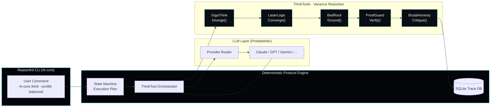

<div align="center">


[](https://github.com/reasonkit/reasonkit-core/actions)
[](https://crates.io/crates/reasonkit-core)
[](https://docs.reasonkit.sh)
[](LICENSE)
[](https://reasonkit.sh)

[Website](https://reasonkit.sh) | [Documentation](https://docs.reasonkit.sh) | [GitHub](https://github.com/reasonkit/reasonkit-core)

</div>

---

## The Problem We Solve

**Most AI is a slot machine.** Insert prompt → pull lever → hope for coherence.

**ReasonKit is a factory.** Input data → execute protocol → get deterministic, auditable output.

LLMs are fundamentally **probabilistic**. Same prompt → different outputs. This creates critical failures:

| Failure           | Impact                    | Our Solution                                      |
| ----------------- | ------------------------- | ------------------------------------------------- |
| **Inconsistency** | Unreliable for production | Deterministic protocol execution                  |
| **Hallucination** | Dangerous falsehoods      | Multi-source triangulation + adversarial critique |
| **Opacity**       | No audit trail            | Complete execution tracing with confidence scores |

**We don't eliminate probability** (impossible). **We constrain it** through structured protocols that force probabilistic outputs into deterministic execution paths.

---

## Quick Start

```bash
# Install (Universal)
curl -fsSL https://reasonkit.sh/install | bash

# Or via Cargo
cargo install reasonkit-core

# Run your first analysis
rk-core think --profile balanced "Should we migrate to microservices?"
```

> **Note:** In v1.0.0, CLI commands other than `mcp`, `serve-mcp`, and `completions` are scaffolded. The examples below describe the planned interface.

**30 seconds to structured reasoning.**

---

## ThinkTools: Variance Reduction Filters

Each ThinkTool acts as a **variance reduction filter**, transforming probabilistic outputs into increasingly deterministic reasoning paths.

<div align="center">

</div>

| ThinkTool         | Operation    | What It Does                                    |
| ----------------- | ------------ | ----------------------------------------------- |
| **GigaThink**     | `Diverge()`  | Generate 10+ perspectives, explore widely       |
| **LaserLogic**    | `Converge()` | Detect fallacies, validate logic, find gaps     |
| **BedRock**       | `Ground()`   | First principles decomposition, identify axioms |
| **ProofGuard**    | `Verify()`   | Multi-source triangulation, require 3+ sources  |
| **BrutalHonesty** | `Critique()` | Adversarial red team, attack your own reasoning |

### The Chain Effect

<div align="center">

</div>

| Stage          | Variance | Reduction |
| -------------- | -------- | --------- |
| Raw LLM Output | 85%      | —         |
| + GigaThink    | 72%      | -13%      |
| + LaserLogic   | 58%      | -14%      |
| + BedRock      | 42%      | -16%      |
| + ProofGuard   | 28%      | -14%      |

**Result:** Raw LLM variance ~85% → Protocol-constrained variance ~28%

---

## Reasoning Profiles

Pre-configured chains for different rigor levels:

```bash
# Fast analysis (70% confidence target)
rk-core think --profile quick "Is this email phishing?"

# Standard analysis (80% confidence target)
rk-core think --profile balanced "Should we use microservices?"

# Thorough analysis (85% confidence target)
rk-core think --profile deep "Design A/B test for feature X"

# Maximum rigor (95% confidence target)
rk-core think --profile paranoid "Validate cryptographic implementation"
```

| Profile      | Chain                   | Confidence | Use Case           |
| ------------ | ----------------------- | ---------- | ------------------ |
| `--quick`    | GigaThink → LaserLogic  | 70%        | Fast sanity checks |
| `--balanced` | All 5 ThinkTools        | 80%        | Standard decisions |
| `--deep`     | All 5 + meta-cognition  | 85%        | Complex problems   |
| `--paranoid` | All 5 + validation pass | 95%        | Critical decisions |

---

## Execution Trace Example

<div align="center">

</div>

**What This Shows:**

- **Transparency:** See exactly where confidence comes from
- **Auditability:** Every step logged and verifiable
- **Deterministic Path:** Same protocol → same execution flow
- **Variance Reduction:** Quantified uncertainty reduction at each stage

---

## Architecture



**Three-Layer Architecture:**

1. **Probabilistic LLM** (Unavoidable)
   - LLMs generate tokens probabilistically
   - Same prompt → different outputs
   - We **cannot eliminate** this

2. **Deterministic Protocol Engine** (Our Innovation)
   - Wraps the probabilistic LLM layer
   - Enforces strict execution paths
   - Validates outputs against schemas
   - State machine ensures consistent flow

3. **ThinkTool Chain** (Variance Reduction)
   - Each ThinkTool reduces variance
   - Multi-stage validation catches errors
   - Confidence scoring quantifies uncertainty

**Key Components:**

- **Protocol Engine:** Orchestrates execution with strict state management
- **ThinkTools:** Modular cognitive operations with defined contracts
- **LLM Integration:** Unified client (Claude, GPT, Gemini, 18+ providers)
- **Telemetry:** Local SQLite for execution traces + variance metrics

---

## Built for Production

ReasonKit is written in Rust because reasoning infrastructure demands reliability.

| Capability               | What It Means For You                               |
| ------------------------ | --------------------------------------------------- |
| **Predictable Latency**  | <5ms response time, no garbage collection pauses    |
| **Memory Safety**        | Zero crashes from null pointers or buffer overflows |
| **Single Binary**        | Deploy anywhere, no Python environment required     |
| **Fearless Concurrency** | Run 100+ reasoning chains in parallel safely        |
| **Type Safety**          | Errors caught at compile time, not runtime          |

**Why This Matters:**

Your AI reasoning shouldn't crash in production. It shouldn't pause for garbage collection during critical decisions. It shouldn't require complex environment management to deploy.

ReasonKit's Rust foundation ensures deterministic, auditable execution every time—the same engineering choice trusted by Linux, Cloudflare, Discord, and AWS for their most critical infrastructure.

---

## Memory Infrastructure (Optional)

**Memory modules (storage, embedding, retrieval, RAPTOR, indexing) are available in the standalone [`reasonkit-mem`](https://crates.io/crates/reasonkit-mem) crate.**

Enable the `memory` feature to use these modules:

```toml
[dependencies]
reasonkit-core = { version = "1.0", features = ["memory"] }
```

**Features:**

- Qdrant vector database (embedded mode)
- Hybrid search (dense + sparse fusion)
- RAPTOR hierarchical retrieval
- Local embeddings (BGE-M3 ONNX)
- BM25 full-text search (Tantivy)

---

## Installation

**Primary Method (Universal):**

```bash
curl -fsSL https://reasonkit.sh/install | bash
```

<details>
<summary><strong>Alternative Methods</strong></summary>

```bash
# Cargo (Rust) - Recommended for Developers
cargo install reasonkit-core

# npm (Node.js) - CLI Wrapper
npm install -g @reasonkit/cli

# uv (Python) - Bindings Only
uv pip install reasonkit
```

</details>

---

## Usage Examples

**Standard Operations:**

```bash
# Balanced analysis (5-step protocol)
rk-core think --profile balanced "Should we migrate our monolith to microservices?"

# Quick sanity check (2-step protocol)
rk-core think --profile quick "Is this email a phishing attempt?"

# Maximum rigor (paranoid mode)
rk-core think --profile paranoid "Validate this cryptographic implementation"

# Scientific method (research & experiments)
rk-core think --profile scientific "Design A/B test for feature X"
```

**With Memory (RAG):**

```bash
# Ingest documents
rk-core ingest document.pdf

# Query with RAG
rk-core query "What are the key findings in the research papers?"

# View execution traces
rk-core trace list
rk-core trace export <id>
```

---

## Contributing: The 5 Gates of Quality

We demand excellence. All contributions must pass **The 5 Gates of Quality**:

```bash
# Clone & Setup
git clone https://github.com/reasonkit/reasonkit-core
cd reasonkit-core

# The 5 Gates (MANDATORY)
cargo build --release        # Gate 1: Compilation (Exit 0)
cargo clippy -- -D warnings  # Gate 2: Linting (0 errors)
cargo fmt --check            # Gate 3: Formatting (Pass)
cargo test --all-features    # Gate 4: Testing (100% pass)
cargo bench                  # Gate 5: Performance (<5% regression)
```

**Quality Score Target:** 8.0/10 minimum for release.

See [CONTRIBUTING.md](CONTRIBUTING.md) for complete guidelines.

---

## Design Philosophy: Honest Engineering

**We don't claim to eliminate probability.** That's impossible. LLMs are probabilistic by design.

**We do claim to constrain it.** Through structured protocols, multi-stage validation, and deterministic execution paths, we transform probabilistic token generation into auditable reasoning chains.

| What We Battle    | How We Battle It                                 | What We're Honest About                           |
| ----------------- | ------------------------------------------------ | ------------------------------------------------- |
| **Inconsistency** | Deterministic protocol execution                 | LLM outputs still vary, but execution paths don't |
| **Hallucination** | Multi-source triangulation, adversarial critique | Can't eliminate, but can detect and flag          |
| **Opacity**       | Full execution tracing, confidence scoring       | Transparency doesn't guarantee correctness        |
| **Uncertainty**   | Explicit confidence metrics, variance reduction  | We quantify uncertainty, not eliminate it         |

---

## License

**Apache 2.0** - See [LICENSE](LICENSE)

**Open Source Core:** All core reasoning protocols and ThinkTools are open source under Apache 2.0.

---

<div align="center">

**ReasonKit** — Turn Prompts into Protocols

_Designed, Not Dreamed_

[Website](https://reasonkit.sh) | [Documentation](https://docs.reasonkit.sh) | [GitHub](https://github.com/reasonkit/reasonkit-core) | [Discord](https://discord.gg/reasonkit)

</div>
