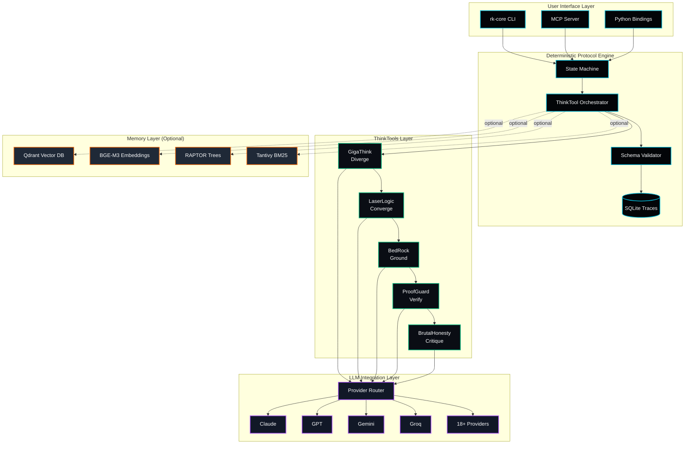

# ReasonKit Architecture

> Comprehensive system architecture documentation for developers and contributors

**Version:** 1.0.0
**Last Updated:** 2026-01-01
**Status:** Production

---

## Table of Contents

1. [Overview](#overview)
2. [System Architecture](#system-architecture)
3. [Component Descriptions](#component-descriptions)
4. [Data Flow](#data-flow)
5. [ThinkTools Pipeline](#thinktools-pipeline)
6. [Integration Points](#integration-points)
7. [Feature Flags](#feature-flags)
8. [Deployment Topologies](#deployment-topologies)
9. [Performance Characteristics](#performance-characteristics)
10. [Security Architecture](#security-architecture)

---

## Overview

ReasonKit is a **Rust-first reasoning engine** that transforms probabilistic LLM outputs into deterministic, auditable reasoning chains. The system is built on three core principles:

1. **Deterministic Protocol Execution**: State machine wraps LLM calls with schema validation
2. **Variance Reduction**: Multi-stage ThinkTool chain constrains output variability
3. **Full Auditability**: Every reasoning step is traced and persisted

### Architecture Philosophy

```
"Designed, Not Dreamed"
- Structure beats intelligence
- Deterministic paths over probabilistic hope
- Audit trails are non-negotiable
```

---

## System Architecture

### High-Level Overview

```
                                ReasonKit Ecosystem
+----------------------------------------------------------------------------+
|                                                                            |
|  +---------------------------+    +---------------------------+            |
|  |     reasonkit-core        |    |      reasonkit-mem        |            |
|  |    (Reasoning Engine)     |<-->|   (Memory Infrastructure) |            |
|  +---------------------------+    +---------------------------+            |
|              ^                                 ^                           |
|              |                                 |                           |
|              v                                 |                           |
|  +---------------------------+                 |                           |
|  |      reasonkit-web        |                 |                           |
|  |   (Web Sensing Layer)     |-----------------+                           |
|  +---------------------------+                                             |
|              ^                                                             |
|              |                                                             |
|  +-----------+---------------+                                             |
|  |      External LLMs        |    reasonkit-pro (Proprietary)              |
|  | Claude | GPT | Gemini ... |    +---------------------------+            |
|  +---------------------------+    | Advanced ThinkTools       |            |
|                                   | Enterprise Features       |            |
|                                   +---------------------------+            |
+----------------------------------------------------------------------------+
```

### Three-Layer Architecture (Mermaid)



---

## Component Descriptions

### Core Components (reasonkit-core)

| Component | Module | Purpose |
|-----------|--------|---------|
| **ReasoningLoop** | `engine/` | Main async execution engine for structured reasoning |
| **ProtocolExecutor** | `thinktool/executor.rs` | Executes ThinkTool protocols with validation |
| **UnifiedLlmClient** | `thinktool/llm.rs` | Provider-agnostic LLM client (18+ providers) |
| **MCP Server** | `mcp/` | Model Context Protocol server for tool integration |
| **Telemetry** | `telemetry/` | Privacy-preserving metrics and tracing |
| **Orchestration** | `orchestration/` | Long-horizon task coordination (100+ tool calls) |

### ThinkTools (5 Core Modules)

| ThinkTool | Code | Operation | Purpose |
|-----------|------|-----------|---------|
| **GigaThink** | `gt` | `Diverge()` | Generate 10+ perspectives, explore solution space |
| **LaserLogic** | `ll` | `Converge()` | Detect fallacies, validate logical chains |
| **BedRock** | `br` | `Ground()` | First principles decomposition, identify axioms |
| **ProofGuard** | `pg` | `Verify()` | Multi-source triangulation (3+ sources required) |
| **BrutalHonesty** | `bh` | `Critique()` | Adversarial self-critique, find flaws first |

### Memory Components (reasonkit-mem)

| Component | Module | Purpose |
|-----------|--------|---------|
| **Storage** | `storage/` | Qdrant vector + file-based storage backends |
| **Embedding** | `embedding/` | Dense vectors (BGE-M3 ONNX, OpenAI, etc.) |
| **Retrieval** | `retrieval/` | Hybrid search, RRF fusion, cross-encoder reranking |
| **RAPTOR** | `raptor/` | Hierarchical tree structure for long-form QA |
| **Indexing** | `indexing/` | BM25/Tantivy sparse indexing |

### Web Components (reasonkit-web)

| Component | Module | Purpose |
|-----------|--------|---------|
| **Browser** | `browser/` | Headless browser control and DOM extraction |
| **Extraction** | `extraction/` | Content extraction and preprocessing |
| **MCP Sidecar** | `mcp/` | Web sensing as MCP tool provider |
| **Handlers** | `handlers/` | HTTP request/response processing |

---

## Data Flow

### Reasoning Request Flow

```
User Query
    |
    v
+------------------+
| CLI / API / Py   |
+--------+---------+
         |
         v
+------------------+      +------------------+
| Profile Selector | ---> | Config Manager   |
+--------+---------+      +------------------+
         |
         v
+------------------+
| State Machine    |
+--------+---------+
         |
         v
+------------------+
| ThinkTool        |
| Orchestrator     |
+--------+---------+
         |
    +----+----+----+----+----+
    |    |    |    |    |    |
    v    v    v    v    v    v
   GT   LL   BR   PG   BH  (Synthesis)
    |    |    |    |    |    |
    +----+----+----+----+----+
         |
         v
+------------------+
| Confidence       |
| Scorer           |
+--------+---------+
         |
         v
+------------------+
| Schema Validator |
+--------+---------+
         |
         v
+------------------+
| SQLite Trace     |
+--------+---------+
         |
         v
+------------------+
| JSON Output      |
+------------------+
```

### Memory-Augmented Flow

```
User Query
    |
    +----------------+
    |                |
    v                v
+--------+    +-------------+
| Query  |    | Memory      |
| Parse  |    | Interface   |
+---+----+    +------+------+
    |                |
    |                v
    |         +-------------+
    |         | Hybrid      |
    |         | Search      |
    |         | (Dense+BM25)|
    |         +------+------+
    |                |
    |                v
    |         +-------------+
    |         | RRF Fusion  |
    |         | + Rerank    |
    |         +------+------+
    |                |
    v                v
+------------------------+
| Context Window         |
| (Query + Retrieved)    |
+----------+-------------+
           |
           v
+------------------------+
| ThinkTool Pipeline     |
+------------------------+
```

---

## ThinkTools Pipeline

### Profile Execution Patterns

#### Quick Profile (Parallel Execution)

```
START
  |
  +--------+--------+
  |                 |
  v                 v
GigaThink      LaserLogic
  |                 |
  +--------+--------+
           |
           v
    Merge Outputs
           |
           v
      Synthesize
           |
           v
    Confidence: ~70%
    Duration: ~2s
```

#### Balanced Profile (Sequential)

```
START
  |
  v
GigaThink (10+ perspectives)
  |
  v
BedRock (first principles)
  |
  v
LaserLogic (logic validation)
  |
  v
ProofGuard (triangulation)
  |
  v
Synthesize
  |
  v
Confidence: ~80%
Duration: ~5s
```

#### Deep Profile (Sequential + Feedback Loop)

```
START
  |
  v
GigaThink
  |
  v
BedRock
  |
  v
LaserLogic
  |
  v
ProofGuard
  |
  v
BrutalHonesty -------+
  |                  |
  v                  |
Flaws Found?         |
  |                  |
  +--Yes-------------+ (re-run failed modules)
  |
  v--No
Synthesize
  |
  v
Confidence: ~85%
Duration: ~8s
```

#### Paranoid Profile (Multi-Pass Validation)

```
START
  |
  v
+---------------------------+
| PASS 1: Initial Analysis  |
| gt -> br -> ll -> pg      |
+------------+--------------+
             |
             v
+---------------------------+
| PASS 2: Adversarial       |
| BrutalHonesty critique    |
+------------+--------------+
             |
             v
+---------------------------+
| PASS 3: Re-execute        |
| Failed/flagged modules    |
+------------+--------------+
             |
             v
+---------------------------+
| PASS 4: Final Verification|
| pg -> bh (confirmation)   |
+------------+--------------+
             |
             v
         Synthesize
             |
             v
     Confidence: ~95%
     Duration: ~12s
```

### Variance Reduction Pipeline

```
Raw LLM Output (~85% variance)
         |
         v
+------------------+
| GigaThink        | -- Expand solution space, capture alternatives
| (Divergence)     | -- Variance: ~75%
+--------+---------+
         |
         v
+------------------+
| LaserLogic       | -- Prune invalid paths, detect fallacies
| (Convergence)    | -- Variance: ~60%
+--------+---------+
         |
         v
+------------------+
| BedRock          | -- Ground in first principles
| (Foundation)     | -- Variance: ~45%
+--------+---------+
         |
         v
+------------------+
| ProofGuard       | -- Triangulate with 3+ sources
| (Verification)   | -- Variance: ~35%
+--------+---------+
         |
         v
+------------------+
| BrutalHonesty    | -- Attack own reasoning
| (Critique)       | -- Variance: ~28%
+--------+---------+
         |
         v
Protocol-Constrained Output
```

---

## Integration Points

### Core <-> Memory Integration

```rust
// Enable with: cargo build --features memory
use reasonkit::memory_interface::MemoryService;

// Memory service trait implementation
#[async_trait]
impl MemoryService for QdrantMemory {
    async fn store_document(&self, doc: &Document) -> MemoryResult<Uuid>;
    async fn search(&self, query: &str, top_k: usize) -> MemoryResult<Vec<SearchResult>>;
    async fn get_context(&self, query: &str, top_k: usize) -> MemoryResult<ContextWindow>;
    // ... 15+ methods for complete memory operations
}
```

#### Integration Flow

```
+-------------------+        +-------------------+
|   reasonkit-core  |        |   reasonkit-mem   |
|                   |        |                   |
| MemoryInterface   |<------>| MemoryService     |
| trait             |        | impl              |
|                   |        |                   |
| - store_document  |        | - Qdrant storage  |
| - search          |        | - BGE-M3 embed    |
| - get_context     |        | - Hybrid search   |
| - embed           |        | - RAPTOR trees    |
+-------------------+        +-------------------+
```

### Core <-> Web Integration

```
+-------------------+        +-------------------+
|   reasonkit-core  |        |   reasonkit-web   |
|                   |        |                   |
| MCP Client        |<------>| MCP Server        |
|                   |        |                   |
| - call_tool()     |        | - web_fetch       |
| - list_tools()    |        | - web_extract     |
| - connect()       |        | - dom_query       |
+-------------------+        +-------------------+
         ^
         |
         v
+-------------------+
| Web Sensing       |
| Capabilities      |
|                   |
| - URL fetching    |
| - DOM extraction  |
| - Screenshot      |
| - Readability     |
+-------------------+
```

### MCP Protocol Integration

```
+-------------------------------------------------------------------+
|                      MCP Registry (Coordinator)                    |
|                                                                    |
|   - Server discovery        - Health monitoring                   |
|   - Capability aggregation  - Tool routing                        |
+-------------------------------------------------------------------+
                              |
          +-------------------+-------------------+
          |                   |                   |
          v                   v                   v
+------------------+  +------------------+  +------------------+
| ThinkTool Server |  | Memory Server    |  | Web Server       |
|                  |  |                  |  |                  |
| - gigathink      |  | - search         |  | - fetch          |
| - laserlogic     |  | - store          |  | - extract        |
| - bedrock        |  | - embed          |  | - screenshot     |
| - proofguard     |  | - raptor_query   |  | - dom_query      |
| - brutalhonesty  |  |                  |  |                  |
+------------------+  +------------------+  +------------------+
          |                   |                   |
          +-------------------+-------------------+
                              |
                              v
+-------------------------------------------------------------------+
|                      Transport Layer                               |
|                                                                    |
|   - JSON-RPC 2.0 over stdio (primary)                             |
|   - HTTP/SSE (optional)                                            |
+-------------------------------------------------------------------+
```

---

## Feature Flags

### Cargo Features

| Feature | Dependencies | Purpose |
|---------|--------------|---------|
| `default` | `cli` | Basic CLI functionality |
| `cli` | - | Command-line interface |
| `memory` | `reasonkit-mem`, `qdrant-client`, `tantivy` | Full memory infrastructure |
| `local-embeddings` | `ort`, `tokenizers`, `ndarray` | BGE-M3 ONNX local inference |
| `embedded-qdrant` | - | Qdrant embedded mode |
| `arf` | `sled`, `wasmtime`, `sysinfo`, `petgraph`, `rust-bert`, `parking_lot` | Advanced Reasoning Framework |
| `aesthetic` | `md5` | UI/UX assessment system |
| `vibe` | - | VIBE Protocol Validation (experimental) |
| `code-intelligence` | - | Multi-language code analysis (experimental) |
| `minimax` | - | MiniMax M2 enhanced tools (experimental) |

### Build Configurations

```bash
# Minimal (reasoning only)
cargo build --release

# With memory infrastructure
cargo build --release --features memory

# With local embeddings (offline capable)
cargo build --release --features "memory,local-embeddings"

# Full feature set
cargo build --release --features "memory,local-embeddings,arf,aesthetic"
```

---

## Deployment Topologies

### Standalone CLI

```
+------------------+
| rk-core CLI      |
|                  |
| - Local SQLite   |
| - LLM API calls  |
| - No server      |
+------------------+
```

### MCP Sidecar

```
+------------------+     +------------------+
| Host Application |<--->| rk-core MCP      |
| (Claude, etc.)   |     | Server           |
+------------------+     +--------+---------+
                                  |
                                  v
                         +------------------+
                         | LLM Providers    |
                         +------------------+
```

### Full Stack (Production)

```
+------------------+     +------------------+     +------------------+
| Load Balancer    |---->| rk-core API      |---->| Qdrant Cluster   |
|                  |     | (Multiple)       |     |                  |
+------------------+     +--------+---------+     +------------------+
                                  |
                                  v
                         +------------------+
                         | rk-web Sidecar   |
                         | (Web Sensing)    |
                         +------------------+
```

### Embedded Mode (Zero-Config)

```
+----------------------------------------+
| Application with Embedded ReasonKit    |
|                                        |
| +----------------------------------+   |
| | reasonkit-core (lib)             |   |
| |                                  |   |
| | +----------------------------+   |   |
| | | Embedded Qdrant            |   |   |
| | +----------------------------+   |   |
| |                                  |   |
| | +----------------------------+   |   |
| | | Local BGE-M3 Embeddings    |   |   |
| | +----------------------------+   |   |
| +----------------------------------+   |
+----------------------------------------+
```

---

## Performance Characteristics

### Latency Targets

| Operation | Target | Measured |
|-----------|--------|----------|
| Protocol orchestration | <10ms | ~7ms |
| ThinkTool chain (balanced) | <5s | ~4.2s |
| ThinkTool chain (quick) | <2s | ~1.8s |
| Hybrid search (10 results) | <100ms | ~85ms |
| Embedding (single) | <50ms | ~42ms |
| Concurrent chains (8x) | <10ms overhead | ~7ms |

### Memory Usage

| Component | Base | Per Document | Per Query |
|-----------|------|--------------|-----------|
| Core engine | ~50MB | - | ~5MB |
| Qdrant embedded | ~200MB | ~1KB vectors | ~10MB |
| BGE-M3 model | ~400MB | - | ~50MB |
| SQLite traces | ~10MB | ~1KB/trace | - |

### Throughput

| Scenario | Requests/sec |
|----------|--------------|
| Quick profile (cached) | ~50 |
| Balanced profile | ~10 |
| Deep profile | ~5 |
| Paranoid profile | ~2 |

---

## Security Architecture

### Trust Boundaries

```
+------------------------------------------------------------------+
|                     UNTRUSTED ZONE                                |
|                                                                   |
|  +-------------------+     +-------------------+                  |
|  | User Input        |     | External LLMs    |                  |
|  | (queries, docs)   |     | (API responses)  |                  |
|  +--------+----------+     +--------+----------+                 |
|           |                         |                             |
+-----------|-----------------------|------------------------------ +
            |                         |
            v                         v
+------------------------------------------------------------------+
|                     VALIDATION LAYER                              |
|                                                                   |
|  +-------------------+     +-------------------+                  |
|  | Schema Validation |     | Output Sanitizer |                  |
|  | (JSON Schema)     |     | (prevent inject) |                  |
|  +-------------------+     +-------------------+                  |
+------------------------------------------------------------------+
            |                         |
            v                         v
+------------------------------------------------------------------+
|                     TRUSTED ZONE                                  |
|                                                                   |
|  +-------------------+     +-------------------+                  |
|  | Protocol Engine   |     | Trace Storage    |                  |
|  | (deterministic)   |     | (SQLite)         |                  |
|  +-------------------+     +-------------------+                  |
+------------------------------------------------------------------+
```

### Key Security Properties

| Property | Implementation |
|----------|----------------|
| No hardcoded secrets | Environment variables only (CONS-003) |
| GDPR by default | EU data residency, local-first storage (CONS-004) |
| Input validation | JSON Schema validation on all outputs |
| Audit trail | SQLite traces for all reasoning steps |
| Memory isolation | Rust memory safety, no `unsafe` without approval |

---

## Related Documentation

| Document | Purpose |
|----------|---------|
| [THINKTOOLS_GUIDE.md](./THINKTOOLS_GUIDE.md) | Comprehensive ThinkTools usage guide |
| [THINKTOOLS_ARCHITECTURE.md](./THINKTOOLS_ARCHITECTURE.md) | ThinkTools-specific architecture diagrams |
| [API_REFERENCE.md](./API_REFERENCE.md) | Complete API documentation |
| [CLI_REFERENCE.md](./CLI_REFERENCE.md) | CLI command reference |
| [MEMORY_INTERFACE_DESIGN.md](./MEMORY_INTERFACE_DESIGN.md) | Memory service interface design |
| [QUICKSTART.md](./QUICKSTART.md) | Getting started guide |

---

## Version History

| Version | Date | Changes |
|---------|------|---------|
| 1.0.0 | 2026-01-01 | Initial comprehensive architecture documentation |

---

*"Designed, Not Dreamed. Turn Prompts into Protocols."*
*https://reasonkit.sh*
