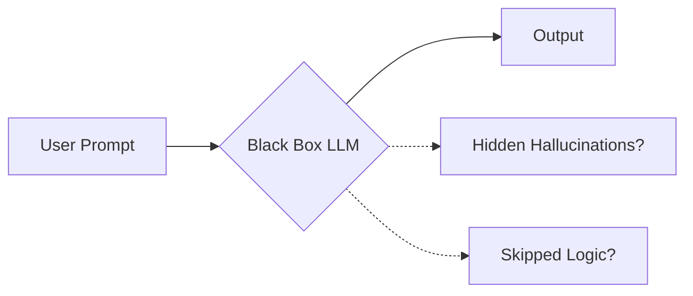
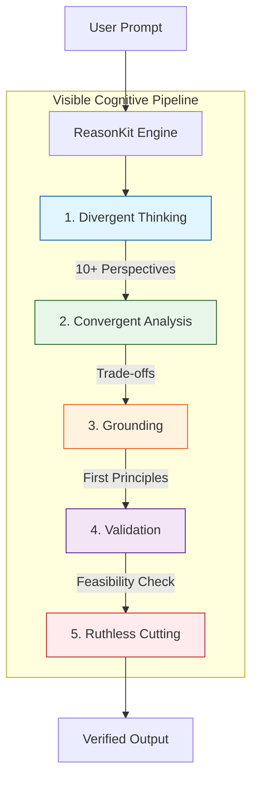
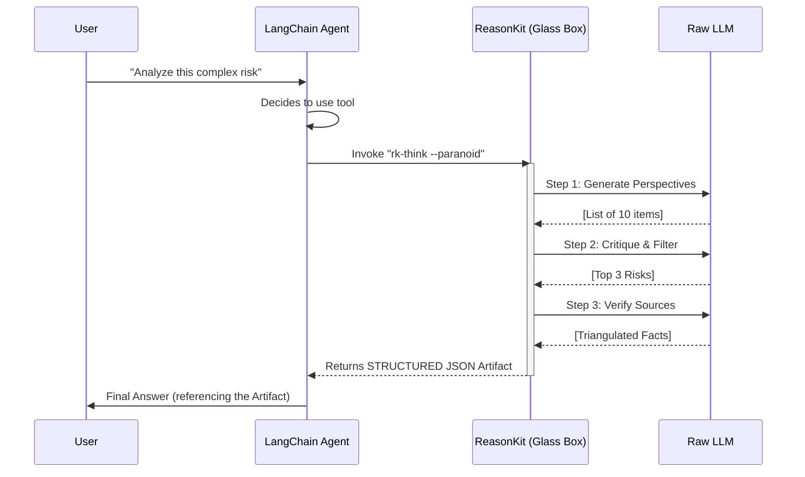

# Core Concepts: The Glass Box Architecture

> **"Stop hoping your LLM 'gets it.' Start engineering how it thinks."**

## The "Glass Box" vs. "Black Box"

The fundamental value of ReasonKit is the shift from opaque probabilistic generation to transparent, auditable cognitive processes.

### 1. The Black Box (Standard LLM)
You pour context in, and get a result out. You have no idea if it hallucinated, skipped steps, or just got lucky.

### 2. The Glass Box (ReasonKit)
Every step of the thinking process is exposed, structured, and verified.

---

## The 5-Step Integrity Process

This process is hard-coded into our protocols. It forces the AI to behave like a senior engineer, not a junior chatbot.

### Step 1: Divergent Thinking (Many Ideas)
*   **Module:** `GigaThink`
*   **Action:** Forces the generation of at least 10 distinct perspectives or dimensions.
*   **Why:** Prevents "tunnel vision" and the availability heuristic.

### Step 2: Convergent Analysis (Prioritization)
*   **Module:** `LaserLogic`
*   **Action:** Applies strict criteria to filter the noise.
*   **Why:** Raw creativity is useless without discernment.

### Step 3: Grounding (First Principles)
*   **Module:** `BedRock`
*   **Action:** Decomposes remaining ideas to their fundamental axioms.
*   **Why:** Ensures solutions aren't built on shaky assumptions.

### Step 4: Validation (Feasibility Check)
*   **Module:** `ProofGuard`
*   **Action:** Triangulates claims against external sources or logical rules.
*   **Why:** Trust, but verify. Then verify again.

### Step 5: Ruthless Cutting (Focus)
*   **Module:** `BrutalHonesty`
*   **Action:** Strips away fluff, hedging, and "AI slop."
*   **Why:** The best code is no code. The best answer is the shortest correct one.

---

## Integration Architecture

How ReasonKit fits into your existing agent stack (e.g., LangChain, AutoGen).

