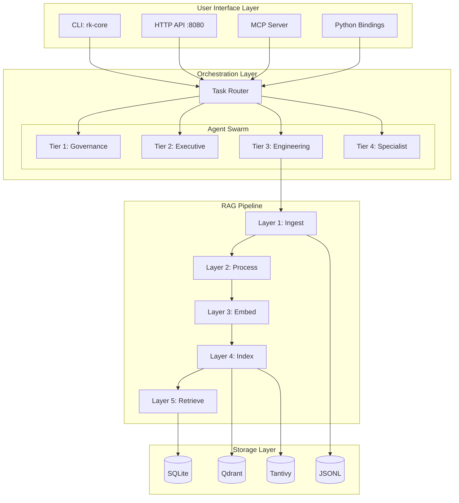
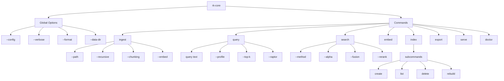
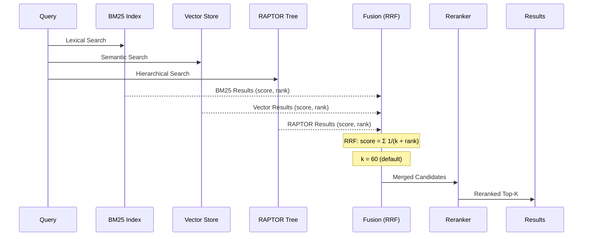
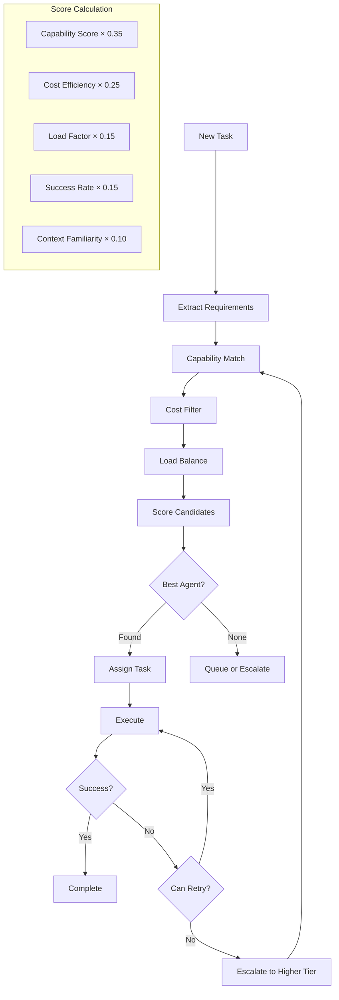
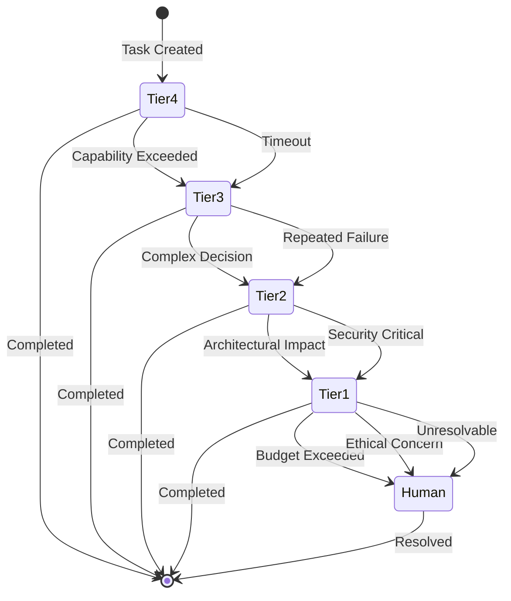
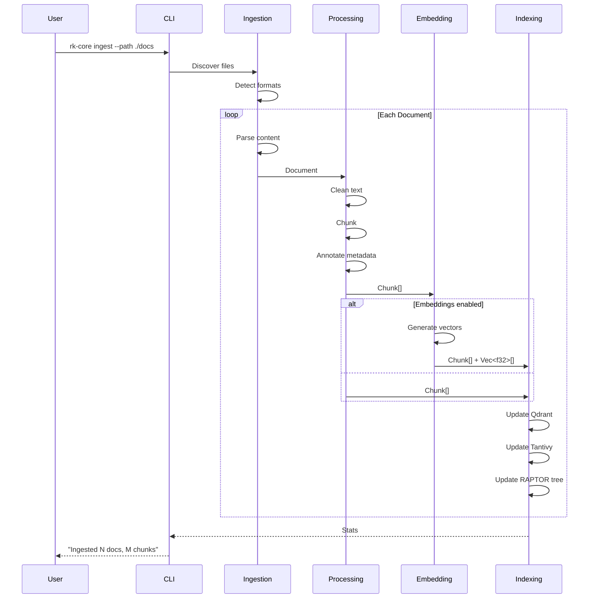
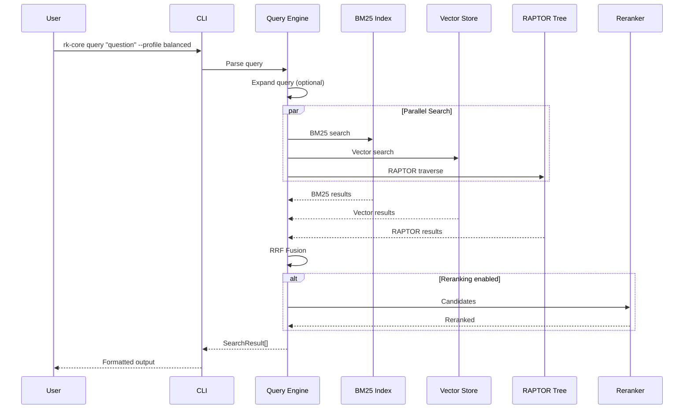
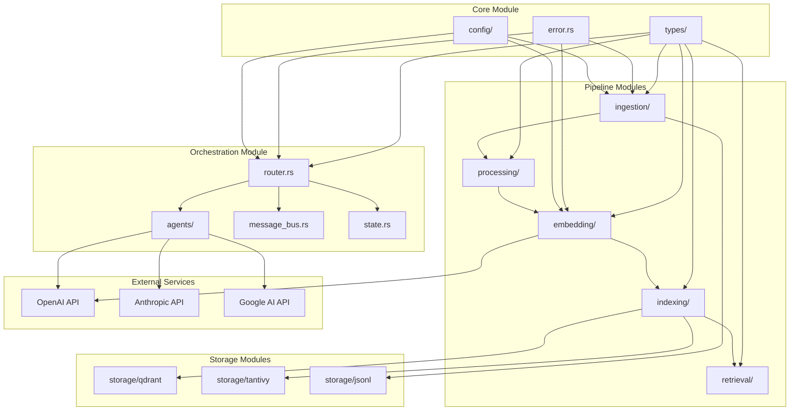

# ReasonKit Architecture Diagrams
> Consolidated Visual Reference for All System Components
> Version: 1.0.0 | Last Updated: 2025-12-11

---

## Table of Contents

1. [System Overview](#system-overview)
2. [CLI Command Flow](#cli-command-flow)
3. [RAG Pipeline Architecture](#rag-pipeline-architecture)
4. [Multi-Agent Orchestration](#multi-agent-orchestration)
5. [Data Flow Diagrams](#data-flow-diagrams)
6. [Component Interactions](#component-interactions)

---

## System Overview

### High-Level Architecture (ASCII)

```
╔═══════════════════════════════════════════════════════════════════════════════════════╗
║                                  REASONKIT CORE                                        ║
║                        "Turn Prompts into Protocols"                                   ║
╠═══════════════════════════════════════════════════════════════════════════════════════╣
║                                                                                        ║
║   ┌──────────────────────────────────────────────────────────────────────────────┐    ║
║   │                           USER INTERFACE LAYER                                │    ║
║   │  ┌──────────┐  ┌──────────┐  ┌──────────┐  ┌──────────┐  ┌──────────┐       │    ║
║   │  │   CLI    │  │HTTP API  │  │   MCP    │  │  Python  │  │  Hooks   │       │    ║
║   │  │ rk-core  │  │  :8080   │  │ Server   │  │ Bindings │  │ System   │       │    ║
║   │  └────┬─────┘  └────┬─────┘  └────┬─────┘  └────┬─────┘  └────┬─────┘       │    ║
║   └───────┼─────────────┼────────────┼─────────────┼─────────────┼──────────────┘    ║
║           │             │            │             │             │                    ║
║           └─────────────┴────────────┴─────────────┴─────────────┘                    ║
║                                      │                                                ║
║   ┌──────────────────────────────────┼─────────────────────────────────────────────┐  ║
║   │                         ORCHESTRATION LAYER                                     │  ║
║   │                                  │                                              │  ║
║   │  ┌──────────────────────────────▼───────────────────────────────────────────┐  │  ║
║   │  │                        TASK ROUTER                                        │  │  ║
║   │  │  ┌─────────────┐  ┌─────────────┐  ┌─────────────┐  ┌─────────────┐      │  │  ║
║   │  │  │ Capability  │  │    Cost     │  │    Load     │  │  Priority   │      │  │  ║
║   │  │  │  Matching   │  │ Optimization│  │  Balancing  │  │   Queuing   │      │  │  ║
║   │  │  └─────────────┘  └─────────────┘  └─────────────┘  └─────────────┘      │  │  ║
║   │  └──────────────────────────────────────────────────────────────────────────┘  │  ║
║   │                                  │                                              │  ║
║   │  ┌──────────────────────────────▼───────────────────────────────────────────┐  │  ║
║   │  │                        AGENT SWARM                                        │  │  ║
║   │  │                                                                           │  │  ║
║   │  │  ┌───────────┐  ┌───────────┐  ┌───────────┐  ┌───────────┐              │  │  ║
║   │  │  │  TIER 1   │  │  TIER 2   │  │  TIER 3   │  │  TIER 4   │              │  │  ║
║   │  │  │Governance │  │ Executive │  │Engineering│  │Specialist │              │  │  ║
║   │  │  │           │  │           │  │           │  │           │              │  │  ║
║   │  │  │ • Opus    │  │ • Gemini  │  │ • Codex   │  │ • Math    │              │  │  ║
║   │  │  │           │  │ • Sonnet  │  │ • Grok    │  │ • Security│              │  │  ║
║   │  │  │           │  │           │  │ • Haiku   │  │           │              │  │  ║
║   │  │  └───────────┘  └───────────┘  └───────────┘  └───────────┘              │  │  ║
║   │  └──────────────────────────────────────────────────────────────────────────┘  │  ║
║   └────────────────────────────────────────────────────────────────────────────────┘  ║
║                                      │                                                ║
║   ┌──────────────────────────────────┼─────────────────────────────────────────────┐  ║
║   │                         RAG PIPELINE LAYER                                      │  ║
║   │                                  │                                              │  ║
║   │  ┌──────────┐  ┌──────────┐  ┌──────────┐  ┌──────────┐  ┌──────────┐         │  ║
║   │  │ LAYER 1  │  │ LAYER 2  │  │ LAYER 3  │  │ LAYER 4  │  │ LAYER 5  │         │  ║
║   │  │          │  │          │  │          │  │          │  │          │         │  ║
║   │  │ Ingest   │─▶│ Process  │─▶│ Embed    │─▶│ Index    │─▶│ Retrieve │         │  ║
║   │  │          │  │          │  │          │  │          │  │          │         │  ║
║   │  │ PDF,MD   │  │ Chunk    │  │ OpenAI   │  │ Qdrant   │  │ Hybrid   │         │  ║
║   │  │ HTML,etc │  │ Clean    │  │ Local    │  │ Tantivy  │  │ RAPTOR   │         │  ║
║   │  └──────────┘  └──────────┘  └──────────┘  └──────────┘  └──────────┘         │  ║
║   └────────────────────────────────────────────────────────────────────────────────┘  ║
║                                      │                                                ║
║   ┌──────────────────────────────────┼─────────────────────────────────────────────┐  ║
║   │                         STORAGE LAYER                                           │  ║
║   │                                                                                 │  ║
║   │  ┌───────────────┐  ┌───────────────┐  ┌───────────────┐  ┌───────────────┐    │  ║
║   │  │    Qdrant     │  │   Tantivy     │  │    JSONL      │  │   SQLite      │    │  ║
║   │  │ (Vectors)     │  │   (BM25)      │  │   (Docs)      │  │   (Meta)      │    │  ║
║   │  └───────────────┘  └───────────────┘  └───────────────┘  └───────────────┘    │  ║
║   └────────────────────────────────────────────────────────────────────────────────┘  ║
║                                                                                        ║
╚═══════════════════════════════════════════════════════════════════════════════════════╝
```

### High-Level Architecture (Mermaid)



---

## CLI Command Flow

### Command Dispatch (ASCII)

```
┌─────────────────────────────────────────────────────────────────────────────┐
│                           CLI COMMAND DISPATCH                               │
├─────────────────────────────────────────────────────────────────────────────┤
│                                                                              │
│   USER INPUT                                                                 │
│       │                                                                      │
│       ▼                                                                      │
│   ┌────────────────────────────────────────────────────────────────────┐    │
│   │                         ARGUMENT PARSER                             │    │
│   │                         (clap derive)                               │    │
│   └───────────────────────────────┬────────────────────────────────────┘    │
│                                   │                                          │
│       ┌───────────────────────────┼───────────────────────────────┐         │
│       │                           │                               │         │
│       ▼                           ▼                               ▼         │
│   ┌─────────┐               ┌─────────┐                     ┌─────────┐    │
│   │ Global  │               │ Command │                     │ Config  │    │
│   │  Args   │               │  Match  │                     │  Load   │    │
│   │         │               │         │                     │         │    │
│   │--config │               │ ingest  │                     │ TOML    │    │
│   │--verbose│               │ query   │                     │ ENV     │    │
│   │--format │               │ search  │                     │         │    │
│   └────┬────┘               │ embed   │                     └────┬────┘    │
│        │                    │ index   │                          │         │
│        │                    │ export  │                          │         │
│        │                    │ serve   │                          │         │
│        │                    │ doctor  │                          │         │
│        │                    └────┬────┘                          │         │
│        │                         │                               │         │
│        └─────────────────────────┼───────────────────────────────┘         │
│                                  │                                          │
│                                  ▼                                          │
│   ┌────────────────────────────────────────────────────────────────────┐    │
│   │                      COMMAND EXECUTOR                               │    │
│   │                                                                     │    │
│   │  ┌──────────┐  ┌──────────┐  ┌──────────┐  ┌──────────┐           │    │
│   │  │ Validate │─▶│ Execute  │─▶│ Format   │─▶│  Output  │           │    │
│   │  │   Args   │  │ Command  │  │ Result   │  │ (stdout) │           │    │
│   │  └──────────┘  └──────────┘  └──────────┘  └──────────┘           │    │
│   └────────────────────────────────────────────────────────────────────┘    │
│                                  │                                          │
│                                  ▼                                          │
│   ┌────────────────────────────────────────────────────────────────────┐    │
│   │                        EXIT CODE                                    │    │
│   │                                                                     │    │
│   │    0=Success  1=Error  2=Config  3=IO  4=Network  5=Auth           │    │
│   └────────────────────────────────────────────────────────────────────┘    │
│                                                                              │
└─────────────────────────────────────────────────────────────────────────────┘
```

### Command Hierarchy (Mermaid)



---

## RAG Pipeline Architecture

### 5-Layer Pipeline (ASCII)

```
┌─────────────────────────────────────────────────────────────────────────────────────┐
│                              RAG PIPELINE ARCHITECTURE                               │
│                              5-Layer RAPTOR Design                                   │
├─────────────────────────────────────────────────────────────────────────────────────┤
│                                                                                      │
│  ╔═══════════════════════════════════════════════════════════════════════════════╗  │
│  ║ LAYER 1: INGESTION                                                             ║  │
│  ╠═══════════════════════════════════════════════════════════════════════════════╣  │
│  ║                                                                                ║  │
│  ║   ┌─────┐  ┌─────┐  ┌─────┐  ┌─────┐  ┌─────┐  ┌─────┐                        ║  │
│  ║   │ PDF │  │ MD  │  │HTML │  │JSON │  │ TXT │  │DOCX │                        ║  │
│  ║   └──┬──┘  └──┬──┘  └──┬──┘  └──┬──┘  └──┬──┘  └──┬──┘                        ║  │
│  ║      │        │        │        │        │        │                           ║  │
│  ║      └────────┴────────┴────────┼────────┴────────┴────────┐                  ║  │
│  ║                                 ▼                          │                  ║  │
│  ║                    ┌────────────────────────┐              │                  ║  │
│  ║                    │    FORMAT DETECTOR     │              │                  ║  │
│  ║                    │    & PARSER ROUTER     │              │                  ║  │
│  ║                    └───────────┬────────────┘              │                  ║  │
│  ║                                │                           │                  ║  │
│  ║                                ▼                           ▼                  ║  │
│  ║                    ┌────────────────────────────────────────┐                 ║  │
│  ║                    │         Document { ... }               │                 ║  │
│  ║                    └────────────────────────────────────────┘                 ║  │
│  ╚═══════════════════════════════════════════════════════════════════════════════╝  │
│                                       │                                              │
│                                       ▼                                              │
│  ╔═══════════════════════════════════════════════════════════════════════════════╗  │
│  ║ LAYER 2: PROCESSING                                                            ║  │
│  ╠═══════════════════════════════════════════════════════════════════════════════╣  │
│  ║                                                                                ║  │
│  ║  ┌─────────────┐    ┌─────────────┐    ┌─────────────┐    ┌─────────────┐     ║  │
│  ║  │   CLEAN     │───▶│   CHUNK     │───▶│  ANNOTATE   │───▶│   DEDUPE    │     ║  │
│  ║  │             │    │             │    │             │    │             │     ║  │
│  ║  │ • Strip     │    │ • Semantic  │    │ • Metadata  │    │ • Hash      │     ║  │
│  ║  │ • Normalize │    │ • Sentence  │    │ • Sections  │    │ • Compare   │     ║  │
│  ║  │ • Unicode   │    │ • Fixed     │    │ • Links     │    │             │     ║  │
│  ║  └─────────────┘    └─────────────┘    └─────────────┘    └─────────────┘     ║  │
│  ║                                                                                ║  │
│  ║                           ┌───────────────────┐                                ║  │
│  ║                           │  Chunk[] Output   │                                ║  │
│  ║                           └───────────────────┘                                ║  │
│  ╚═══════════════════════════════════════════════════════════════════════════════╝  │
│                                       │                                              │
│                                       ▼                                              │
│  ╔═══════════════════════════════════════════════════════════════════════════════╗  │
│  ║ LAYER 3: EMBEDDING                                                             ║  │
│  ╠═══════════════════════════════════════════════════════════════════════════════╣  │
│  ║                                                                                ║  │
│  ║   ┌─────────────────────────────────────────────────────────────────────┐     ║  │
│  ║   │                     EMBEDDING ROUTER                                 │     ║  │
│  ║   └────────────────────────────┬────────────────────────────────────────┘     ║  │
│  ║                                │                                              ║  │
│  ║        ┌───────────────────────┼───────────────────────┐                      ║  │
│  ║        │                       │                       │                      ║  │
│  ║        ▼                       ▼                       ▼                      ║  │
│  ║   ┌─────────┐            ┌─────────┐            ┌─────────┐                   ║  │
│  ║   │ OpenAI  │            │ Voyage  │            │  Local  │                   ║  │
│  ║   │ ada-002 │            │ voyage-2│            │  ONNX   │                   ║  │
│  ║   │ 1536d   │            │ 1024d   │            │  384d   │                   ║  │
│  ║   └─────────┘            └─────────┘            └─────────┘                   ║  │
│  ║                                                                                ║  │
│  ║                      ┌─────────────────────┐                                   ║  │
│  ║                      │  Vec<f32> Vectors   │                                   ║  │
│  ║                      └─────────────────────┘                                   ║  │
│  ╚═══════════════════════════════════════════════════════════════════════════════╝  │
│                                       │                                              │
│                                       ▼                                              │
│  ╔═══════════════════════════════════════════════════════════════════════════════╗  │
│  ║ LAYER 4: INDEXING                                                              ║  │
│  ╠═══════════════════════════════════════════════════════════════════════════════╣  │
│  ║                                                                                ║  │
│  ║   ┌───────────────────────┐         ┌───────────────────────┐                 ║  │
│  ║   │     VECTOR INDEX      │         │      BM25 INDEX       │                 ║  │
│  ║   │       (Qdrant)        │         │      (Tantivy)        │                 ║  │
│  ║   │                       │         │                       │                 ║  │
│  ║   │  ┌─────────────────┐  │         │  ┌─────────────────┐  │                 ║  │
│  ║   │  │      HNSW       │  │         │  │   Inverted      │  │                 ║  │
│  ║   │  │   m=16, ef=100  │  │         │  │   Index         │  │                 ║  │
│  ║   │  └─────────────────┘  │         │  │   k1=1.2 b=0.75 │  │                 ║  │
│  ║   │                       │         │  └─────────────────┘  │                 ║  │
│  ║   └───────────────────────┘         └───────────────────────┘                 ║  │
│  ║                                                                                ║  │
│  ║              ┌────────────────────────────────────────────┐                    ║  │
│  ║              │            RAPTOR TREE                     │                    ║  │
│  ║              │                                            │                    ║  │
│  ║              │    Level 4: [Document Summary]             │                    ║  │
│  ║              │              /         \                   │                    ║  │
│  ║              │    Level 3: [Section]  [Section]           │                    ║  │
│  ║              │             /    \        /    \           │                    ║  │
│  ║              │    Level 2: [P1] [P2]   [P3]  [P4]         │                    ║  │
│  ║              │                                            │                    ║  │
│  ║              │    Level 1: [C1][C2][C3][C4][C5][C6]       │                    ║  │
│  ║              │              (leaf chunks)                 │                    ║  │
│  ║              └────────────────────────────────────────────┘                    ║  │
│  ╚═══════════════════════════════════════════════════════════════════════════════╝  │
│                                       │                                              │
│                                       ▼                                              │
│  ╔═══════════════════════════════════════════════════════════════════════════════╗  │
│  ║ LAYER 5: RETRIEVAL                                                             ║  │
│  ╠═══════════════════════════════════════════════════════════════════════════════╣  │
│  ║                                                                                ║  │
│  ║   QUERY ──────┐                                                                ║  │
│  ║               │                                                                ║  │
│  ║               ▼                                                                ║  │
│  ║   ┌─────────────────┐     ┌─────────────────┐     ┌─────────────────┐         ║  │
│  ║   │  QUERY EXPAND   │────▶│  PARALLEL SEARCH │────▶│     FUSION      │         ║  │
│  ║   │  (optional)     │     │                 │     │                 │         ║  │
│  ║   │  • Synonyms     │     │  ┌────────────┐ │     │  • RRF (k=60)   │         ║  │
│  ║   │  • HyDE         │     │  │ BM25       │ │     │  • Linear       │         ║  │
│  ║   └─────────────────┘     │  └────────────┘ │     │  • Weighted     │         ║  │
│  ║                           │  ┌────────────┐ │     └────────┬────────┘         ║  │
│  ║                           │  │ Vector     │ │              │                  ║  │
│  ║                           │  └────────────┘ │              ▼                  ║  │
│  ║                           │  ┌────────────┐ │     ┌─────────────────┐         ║  │
│  ║                           │  │ RAPTOR     │ │     │    RERANKER     │         ║  │
│  ║                           │  └────────────┘ │     │  (optional)     │         ║  │
│  ║                           └─────────────────┘     │  Cross-encoder  │         ║  │
│  ║                                                   └────────┬────────┘         ║  │
│  ║                                                            │                  ║  │
│  ║                                                            ▼                  ║  │
│  ║                                               ┌─────────────────────┐         ║  │
│  ║                                               │  SearchResult[]     │         ║  │
│  ║                                               └─────────────────────┘         ║  │
│  ╚═══════════════════════════════════════════════════════════════════════════════╝  │
│                                                                                      │
└─────────────────────────────────────────────────────────────────────────────────────┘
```

### RAG Pipeline (Mermaid)

```mermaid
flowchart TB
    subgraph L1["Layer 1: Ingestion"]
        PDF[PDF Parser]
        MD[Markdown Parser]
        HTML[HTML Parser]
        JSON[JSON Parser]
        FD[Format Detector]

        PDF --> FD
        MD --> FD
        HTML --> FD
        JSON --> FD
        FD --> DOC[Document]
    end

    subgraph L2["Layer 2: Processing"]
        CLEAN[Clean]
        CHUNK[Chunk]
        ANNOTATE[Annotate]
        DEDUPE[Dedupe]

        DOC --> CLEAN --> CHUNK --> ANNOTATE --> DEDUPE --> CHUNKS[Chunk[]]
    end

    subgraph L3["Layer 3: Embedding"]
        ROUTER[Embedding Router]
        OPENAI[OpenAI]
        VOYAGE[Voyage]
        LOCAL[Local ONNX]

        CHUNKS --> ROUTER
        ROUTER --> OPENAI
        ROUTER --> VOYAGE
        ROUTER --> LOCAL
        OPENAI --> VECS[Vectors]
        VOYAGE --> VECS
        LOCAL --> VECS
    end

    subgraph L4["Layer 4: Indexing"]
        QDRANT[(Qdrant HNSW)]
        TANTIVY[(Tantivy BM25)]
        RAPTOR[RAPTOR Tree]

        VECS --> QDRANT
        CHUNKS --> TANTIVY
        VECS --> RAPTOR
    end

    subgraph L5["Layer 5: Retrieval"]
        QUERY[Query]
        EXPAND[Query Expand]
        SEARCH[Parallel Search]
        FUSION[Fusion RRF/Linear]
        RERANK[Reranker]
        RESULTS[Results]

        QUERY --> EXPAND --> SEARCH --> FUSION --> RERANK --> RESULTS
        QDRANT --> SEARCH
        TANTIVY --> SEARCH
        RAPTOR --> SEARCH
    end
```

### Hybrid Search Detail (Mermaid)



---

## Multi-Agent Orchestration

### Agent Hierarchy (ASCII)

```
┌─────────────────────────────────────────────────────────────────────────────────┐
│                          MULTI-AGENT HIERARCHY                                   │
├─────────────────────────────────────────────────────────────────────────────────┤
│                                                                                  │
│                           ┌─────────────────────┐                                │
│                           │      TIER 1         │                                │
│                           │    GOVERNANCE       │                                │
│                           │                     │                                │
│                           │  ┌───────────────┐  │                                │
│                           │  │ Claude Opus   │  │                                │
│                           │  │   4.5         │  │                                │
│                           │  │ (200K ctx)    │  │                                │
│                           │  └───────────────┘  │                                │
│                           │                     │                                │
│                           │  • Final arbiter    │                                │
│                           │  • Architecture     │                                │
│                           │  • Quality gates    │                                │
│                           └──────────┬──────────┘                                │
│                                      │                                           │
│                    ┌─────────────────┼─────────────────┐                         │
│                    │                 │                 │                         │
│                    ▼                 ▼                 ▼                         │
│     ┌──────────────────┐  ┌──────────────────┐  ┌──────────────────┐            │
│     │      TIER 2      │  │      TIER 2      │  │      TIER 2      │            │
│     │    EXECUTIVE     │  │    EXECUTIVE     │  │    EXECUTIVE     │            │
│     │                  │  │                  │  │                  │            │
│     │ ┌──────────────┐ │  │ ┌──────────────┐ │  │ ┌──────────────┐ │            │
│     │ │ Gemini 2.5   │ │  │ │Claude Sonnet │ │  │ │ DeepSeek V3  │ │            │
│     │ │   Pro        │ │  │ │    4.5       │ │  │ │              │ │            │
│     │ │ (2M ctx)     │ │  │ │ (200K ctx)   │ │  │ │ (164K ctx)   │ │            │
│     │ └──────────────┘ │  │ └──────────────┘ │  │ └──────────────┘ │            │
│     │                  │  │                  │  │                  │            │
│     │ • Lead engineer  │  │ • Tech review    │  │ • Architecture   │            │
│     │ • Large refactor │  │ • Quality assure │  │ • System design  │            │
│     └────────┬─────────┘  └────────┬─────────┘  └────────┬─────────┘            │
│              │                     │                     │                       │
│              └─────────────────────┼─────────────────────┘                       │
│                                    │                                             │
│         ┌──────────────────────────┼──────────────────────────┐                  │
│         │                          │                          │                  │
│         ▼                          ▼                          ▼                  │
│  ┌──────────────┐          ┌──────────────┐          ┌──────────────┐           │
│  │    TIER 3    │          │    TIER 3    │          │    TIER 3    │           │
│  │ ENGINEERING  │          │ ENGINEERING  │          │ ENGINEERING  │           │
│  │              │          │              │          │              │           │
│  │┌────────────┐│          │┌────────────┐│          │┌────────────┐│           │
│  ││ GPT Codex  ││          ││ Grok Code  ││          ││Claude Haiku││           │
│  ││    5.1     ││          ││   Fast     ││          ││    3.6     ││           │
│  ││ (100K ctx) ││          ││ (128K ctx) ││          ││ (200K ctx) ││           │
│  │└────────────┘│          │└────────────┘│          │└────────────┘│           │
│  │              │          │              │          │              │           │
│  │• Complex Rust│          │• Rapid proto │          │• Documentation│          │
│  │• Unsafe code │          │• Tests       │          │• Comments     │          │
│  └──────────────┘          └──────────────┘          └──────────────┘           │
│                                    │                                             │
│                    ┌───────────────┼───────────────┐                             │
│                    │               │               │                             │
│                    ▼               ▼               ▼                             │
│            ┌─────────────┐  ┌─────────────┐  ┌─────────────┐                     │
│            │   TIER 4    │  │   TIER 4    │  │   TIER 4    │                     │
│            │ SPECIALIST  │  │ SPECIALIST  │  │ SPECIALIST  │                     │
│            │             │  │             │  │             │                     │
│            │┌───────────┐│  │┌───────────┐│  │┌───────────┐│                     │
│            ││DeepSeek   ││  ││Grok-4     ││  ││Mistral    ││                     │
│            ││ Math V3   ││  ││  High     ││  ││ Large 3   ││                     │
│            │└───────────┘│  │└───────────┘│  │└───────────┘│                     │
│            │             │  │             │  │             │                     │
│            │• Math verify│  │• Security   │  │• Performance│                     │
│            │• Proofs     │  │• Red team   │  │• Analysis   │                     │
│            └─────────────┘  └─────────────┘  └─────────────┘                     │
│                                                                                  │
└─────────────────────────────────────────────────────────────────────────────────┘
```

### Task Routing Flow (Mermaid)



### Escalation Chain (Mermaid)



---

## Data Flow Diagrams

### Document Ingestion Flow



### Query Execution Flow



---

## Component Interactions

### Module Dependency Graph



### API Endpoint Map

```
┌─────────────────────────────────────────────────────────────────────────────┐
│                           HTTP API ENDPOINTS                                 │
├─────────────────────────────────────────────────────────────────────────────┤
│                                                                              │
│   GET    /health                 → Health check                              │
│   GET    /version                → Version info                              │
│                                                                              │
│   POST   /v1/ingest              → Ingest documents                          │
│   GET    /v1/documents           → List documents                            │
│   GET    /v1/documents/:id       → Get document                              │
│   DELETE /v1/documents/:id       → Delete document                           │
│                                                                              │
│   POST   /v1/query               → RAG query                                 │
│   POST   /v1/search              → Direct search                             │
│                                                                              │
│   POST   /v1/embed               → Generate embeddings                       │
│                                                                              │
│   GET    /v1/indices             → List indices                              │
│   POST   /v1/indices             → Create index                              │
│   GET    /v1/indices/:name/stats → Index statistics                          │
│   DELETE /v1/indices/:name       → Delete index                              │
│                                                                              │
│   GET    /v1/stats               → System statistics                         │
│   GET    /v1/config              → Current configuration                     │
│                                                                              │
│   WebSocket /v1/ws               → Streaming responses                       │
│                                                                              │
└─────────────────────────────────────────────────────────────────────────────┘
```

---

## Related Documents

- [CLI Architecture](./CLI_ARCHITECTURE.md)
- [RAG Pipeline Architecture](./RAG_PIPELINE_ARCHITECTURE.md)
- [Multi-Agent Orchestration](./MULTI_AGENT_ORCHESTRATION.md)
- [AGENT_DREAM_TEAM.md](../../../AGENT_DREAM_TEAM.md)
- [ORCHESTRATOR.md](../../../ORCHESTRATOR.md)

---

*ReasonKit Architecture Diagrams v1.0.0*
*Designed, Not Dreamed | Turn Prompts into Protocols*
