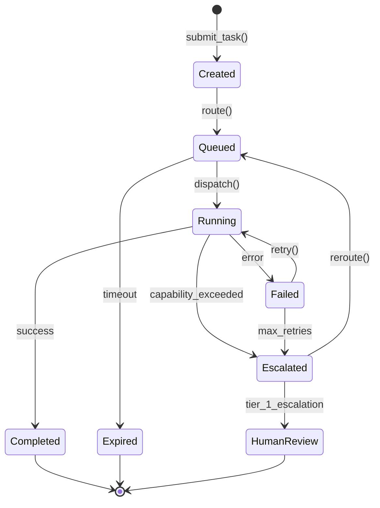
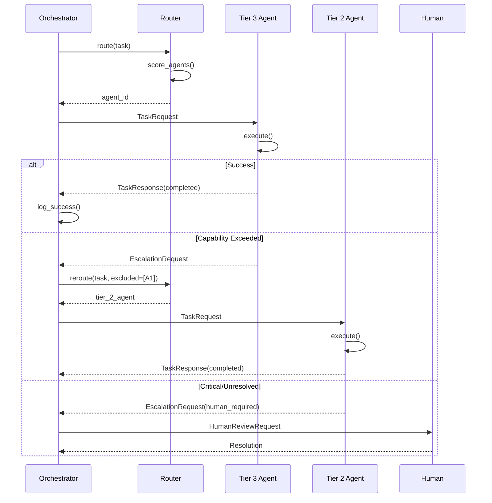

# Multi-Agent Orchestration System Architecture
> ReasonKit Core | Agent Communication, Task Routing, and Coordination Patterns
> Version: 1.0.0 | Last Updated: 2025-12-11

---

## Table of Contents

1. [Executive Summary](#executive-summary)
2. [Architecture Overview](#architecture-overview)
3. [Agent Hierarchy](#agent-hierarchy)
4. [Communication Protocols](#communication-protocols)
5. [Message Formats](#message-formats)
6. [Task Routing Engine](#task-routing-engine)
7. [Coordination Patterns](#coordination-patterns)
8. [State Management](#state-management)
9. [Escalation Procedures](#escalation-procedures)
10. [Rust Type Definitions](#rust-type-definitions)
11. [Configuration Schema](#configuration-schema)
12. [Monitoring & Observability](#monitoring--observability)
13. [Security Model](#security-model)
14. [Diagrams](#diagrams)

---

## Executive Summary

The ReasonKit Multi-Agent Orchestration System (MAOS) provides a structured framework for coordinating AI agents across different tiers, capabilities, and cost profiles. It implements:

- **Hierarchical Agent Management**: 4-tier structure with clear authority chains
- **Intelligent Task Routing**: Cost-aware, capability-matched task distribution
- **Asynchronous Communication**: Event-driven message passing between agents
- **Fault Tolerance**: Automatic failover, retry logic, and escalation
- **Audit Trail**: Complete traceability of all agent actions and decisions

### Design Principles

1. **Rust-First**: All orchestration logic in Rust (no Node.js)
2. **Async by Default**: Tokio-based concurrent execution
3. **Cost-Conscious**: Route to cheapest capable agent
4. **Deterministic**: Reproducible task routing decisions
5. **Observable**: Full telemetry and audit logging

---

## Architecture Overview

```
┌─────────────────────────────────────────────────────────────────────────────┐
│                        MULTI-AGENT ORCHESTRATION SYSTEM                      │
├─────────────────────────────────────────────────────────────────────────────┤
│                                                                              │
│  ┌─────────────────────────────────────────────────────────────────────┐    │
│  │                     ORCHESTRATION LAYER                              │    │
│  │  ┌──────────────┐  ┌──────────────┐  ┌──────────────┐               │    │
│  │  │ Task Router  │  │  Scheduler   │  │  Escalator   │               │    │
│  │  │              │  │              │  │              │               │    │
│  │  │ - Capability │  │ - Priority   │  │ - Timeout    │               │    │
│  │  │   matching   │  │   queues     │  │   detection  │               │    │
│  │  │ - Cost opt   │  │ - Deadlines  │  │ - Failure    │               │    │
│  │  │ - Load bal   │  │ - Batching   │  │   recovery   │               │    │
│  │  └──────────────┘  └──────────────┘  └──────────────┘               │    │
│  └─────────────────────────────────────────────────────────────────────┘    │
│                                    │                                         │
│                                    ▼                                         │
│  ┌─────────────────────────────────────────────────────────────────────┐    │
│  │                     MESSAGE BUS (Event-Driven)                       │    │
│  │  ┌──────────┐  ┌──────────┐  ┌──────────┐  ┌──────────┐            │    │
│  │  │ TaskReq  │  │ TaskResp │  │ AgentEvt │  │ SystemEvt│            │    │
│  │  │ Channel  │  │ Channel  │  │ Channel  │  │ Channel  │            │    │
│  │  └──────────┘  └──────────┘  └──────────┘  └──────────┘            │    │
│  └─────────────────────────────────────────────────────────────────────┘    │
│                                    │                                         │
│        ┌───────────────────────────┼───────────────────────────┐            │
│        │                           │                           │            │
│        ▼                           ▼                           ▼            │
│  ┌───────────┐              ┌───────────┐              ┌───────────┐        │
│  │  TIER 1   │              │  TIER 2   │              │  TIER 3   │        │
│  │ Governance│              │ Executive │              │Engineering│        │
│  │           │              │           │              │           │        │
│  │ • Claude  │              │ • Gemini  │              │ • Codex   │        │
│  │   Opus    │              │   2.5 Pro │              │ • Grok    │        │
│  │           │              │ • Claude  │              │ • Claude  │        │
│  │           │              │   Sonnet  │              │   Haiku   │        │
│  └───────────┘              └───────────┘              └───────────┘        │
│        │                           │                           │            │
│        └───────────────────────────┼───────────────────────────┘            │
│                                    │                                         │
│                                    ▼                                         │
│  ┌─────────────────────────────────────────────────────────────────────┐    │
│  │                     STATE MANAGEMENT LAYER                           │    │
│  │  ┌──────────────┐  ┌──────────────┐  ┌──────────────┐               │    │
│  │  │ Task State   │  │ Agent State  │  │ Session State│               │    │
│  │  │ (JSONL Log)  │  │ (Health/Load)│  │ (Context)    │               │    │
│  │  └──────────────┘  └──────────────┘  └──────────────┘               │    │
│  └─────────────────────────────────────────────────────────────────────┘    │
│                                                                              │
└─────────────────────────────────────────────────────────────────────────────┘
```

---

## Agent Hierarchy

### Tier 1: Governance (Authority Layer)

| Agent | Model | Context | Role | Authority |
|-------|-------|---------|------|-----------|
| **MASTER_ORCHESTRATOR** | Claude Opus 4.5 | 200K | Final arbiter, architecture decisions | FULL |
| **FAILOVER_ORCHESTRATOR** | Claude Sonnet 4.5 | 200K | Backup orchestrator | DELEGATED |

**Responsibilities:**
- Architectural decisions with project-wide impact
- Conflict resolution between agents
- Quality gate enforcement
- Final approval for merges to `main`

### Tier 2: Executive (Strategy Layer)

| Agent | Model | Context | Role | Authority |
|-------|-------|---------|------|-----------|
| **LEAD_ENGINEER** | Gemini 2.5 Pro | 2M | Technical strategy, large refactors | HIGH |
| **TECH_REVIEWER** | Claude Sonnet 4.5 | 200K | Code review, quality assurance | HIGH |
| **ARCHITECT** | DeepSeek V3.2 | 164K | System design, specifications | MEDIUM |

**Responsibilities:**
- Feature planning and design
- Cross-component coordination
- Documentation and specifications
- Performance optimization strategy

### Tier 3: Engineering (Implementation Layer)

| Agent | Model | Context | Role | Authority |
|-------|-------|---------|------|-----------|
| **PRIMARY_CODER** | GPT Codex 5.1 | 100K | Complex Rust, unsafe blocks | STANDARD |
| **PARALLEL_CODER** | Grok Code Fast | 128K | Rapid prototyping, tests | STANDARD |
| **DOC_WRITER** | Claude Haiku 3.6 | 200K | Documentation, comments | STANDARD |

**Responsibilities:**
- Feature implementation
- Unit test creation
- Bug fixes
- Documentation updates

### Tier 4: Specialists (Domain Layer)

| Agent | Model | Context | Role | Authority |
|-------|-------|---------|------|-----------|
| **MATH_VERIFIER** | DeepSeek-Math-V3 | 128K | Mathematical correctness | LIMITED |
| **SECURITY_AUDITOR** | Grok-4-High | 128K | Vulnerability detection | LIMITED |
| **PERF_ANALYST** | Mistral Large 3 | 128K | Performance analysis | LIMITED |

**Responsibilities:**
- Domain-specific validation
- Specialized analysis
- Expert consultation

---

## Communication Protocols

### Protocol Stack

```
┌─────────────────────────────────────────┐
│          APPLICATION LAYER              │
│  Task Requests, Agent Responses         │
├─────────────────────────────────────────┤
│          ROUTING LAYER                  │
│  Capability Matching, Load Balancing    │
├─────────────────────────────────────────┤
│          MESSAGE LAYER                  │
│  JSON-RPC 2.0 over Channels             │
├─────────────────────────────────────────┤
│          TRANSPORT LAYER                │
│  Tokio MPSC Channels (in-process)       │
│  or WebSocket (cross-process)           │
└─────────────────────────────────────────┘
```

### Message Types

| Type | Direction | Purpose |
|------|-----------|---------|
| `TaskRequest` | Orchestrator → Agent | Assign work |
| `TaskResponse` | Agent → Orchestrator | Return results |
| `AgentHeartbeat` | Agent → Orchestrator | Health check |
| `EscalationRequest` | Agent → Tier N-1 | Request help |
| `CancellationSignal` | Orchestrator → Agent | Abort task |
| `StateSync` | Bidirectional | Context sharing |

### Protocol Guarantees

| Guarantee | Implementation |
|-----------|----------------|
| **At-least-once delivery** | Acknowledgment + retry |
| **Ordering** | Sequence numbers per channel |
| **Idempotency** | Task IDs for deduplication |
| **Timeout** | Configurable per task type |

---

## Message Formats

### Task Request (JSON-RPC 2.0)

```json
{
  "jsonrpc": "2.0",
  "method": "execute_task",
  "id": "task_20251211_143022_7f3a",
  "params": {
    "task": {
      "id": "task_20251211_143022_7f3a",
      "type": "code_generation",
      "priority": "high",
      "deadline_ms": 30000,
      "context": {
        "project": "reasonkit-core",
        "component": "retrieval",
        "files": ["src/retrieval/hybrid.rs"],
        "dependencies": ["task_20251211_142900_abc1"]
      },
      "payload": {
        "instruction": "Implement RRF fusion for hybrid search",
        "constraints": ["no unsafe", "must pass clippy"],
        "acceptance_criteria": [
          "Unit tests pass",
          "Benchmark shows <5ms latency"
        ]
      },
      "routing_hints": {
        "required_capabilities": ["rust", "algorithms"],
        "preferred_tier": 3,
        "max_cost_per_token": 0.00002
      }
    }
  }
}
```

### Task Response

```json
{
  "jsonrpc": "2.0",
  "id": "task_20251211_143022_7f3a",
  "result": {
    "status": "completed",
    "agent_id": "primary_coder_codex",
    "execution_time_ms": 12450,
    "token_usage": {
      "input": 2340,
      "output": 1876,
      "cost_usd": 0.0842
    },
    "artifacts": [
      {
        "type": "code",
        "path": "src/retrieval/hybrid.rs",
        "diff": "--- a/src/retrieval/hybrid.rs\n+++ b/src/retrieval/hybrid.rs\n@@ -45,6 +45,42 @@\n+pub fn rrf_fusion(...",
        "checksum": "sha256:a1b2c3..."
      },
      {
        "type": "test",
        "path": "tests/retrieval_test.rs",
        "coverage_delta": "+4.2%"
      }
    ],
    "validation": {
      "clippy": "pass",
      "tests": "pass",
      "benchmark": {
        "latency_p50_ms": 2.3,
        "latency_p99_ms": 4.8
      }
    },
    "confidence": 0.92,
    "notes": "Implemented RRF with k=60 as per literature"
  }
}
```

### Agent Heartbeat

```json
{
  "jsonrpc": "2.0",
  "method": "heartbeat",
  "params": {
    "agent_id": "primary_coder_codex",
    "timestamp": "2025-12-11T14:30:22.000Z",
    "status": "idle",
    "current_load": 0.23,
    "queue_depth": 2,
    "capabilities_available": ["rust", "python", "algorithms"],
    "rate_limit_remaining": 8500,
    "health": {
      "api_latency_ms": 145,
      "error_rate_1h": 0.002
    }
  }
}
```

### Escalation Request

```json
{
  "jsonrpc": "2.0",
  "method": "escalate",
  "id": "esc_20251211_143522_def4",
  "params": {
    "original_task_id": "task_20251211_143022_7f3a",
    "escalating_agent": "parallel_coder_grok",
    "reason": "capability_exceeded",
    "details": "Requires unsafe Rust expertise for SIMD optimization",
    "attempted_solutions": [
      "Used safe abstractions - 3x slower than target",
      "Consulted documentation - no safe pattern found"
    ],
    "suggested_agent_tier": 2,
    "context_snapshot": {
      "files_modified": ["src/retrieval/simd.rs"],
      "partial_progress": 0.6
    }
  }
}
```

---

## Task Routing Engine

### Routing Algorithm

```
INPUT: TaskRequest T
OUTPUT: Agent A

1. EXTRACT required capabilities from T.routing_hints
2. FILTER agents by:
   - capability_match(A.capabilities, T.required_capabilities)
   - tier_match(A.tier, T.preferred_tier)
   - cost_match(A.cost_per_token, T.max_cost_per_token)
   - availability(A.current_load < 0.8)
   - rate_limit(A.rate_limit_remaining > estimated_tokens)

3. SCORE remaining candidates:
   score = w1 * capability_score
         + w2 * cost_efficiency
         + w3 * (1 - current_load)
         + w4 * historical_success_rate
         + w5 * context_familiarity

4. SELECT agent with highest score
5. IF no agent available:
   - Queue task OR
   - Escalate to higher tier OR
   - Return error with retry hint
```

### Capability Matrix

```
┌────────────────────┬─────┬─────┬─────┬─────┬─────┬─────┬─────┐
│ Agent              │Rust │ Py  │Math │SecR │Arch │ Doc │Perf │
├────────────────────┼─────┼─────┼─────┼─────┼─────┼─────┼─────┤
│ Claude Opus 4.5    │ ★★★ │ ★★★ │ ★★★ │ ★★★ │ ★★★ │ ★★★ │ ★★☆ │
│ Gemini 2.5 Pro     │ ★★★ │ ★★★ │ ★★☆ │ ★★☆ │ ★★★ │ ★★★ │ ★★☆ │
│ Claude Sonnet 4.5  │ ★★★ │ ★★★ │ ★★☆ │ ★★★ │ ★★★ │ ★★★ │ ★★☆ │
│ GPT Codex 5.1      │ ★★★ │ ★★★ │ ★★☆ │ ★★☆ │ ★★☆ │ ★★☆ │ ★★☆ │
│ Grok Code Fast     │ ★★☆ │ ★★★ │ ★★☆ │ ★★☆ │ ★★☆ │ ★★☆ │ ★☆☆ │
│ Claude Haiku 3.6   │ ★★☆ │ ★★☆ │ ★☆☆ │ ★☆☆ │ ★☆☆ │ ★★★ │ ★☆☆ │
│ DeepSeek-Math-V3   │ ★☆☆ │ ★★☆ │ ★★★ │ ★☆☆ │ ★☆☆ │ ★☆☆ │ ★☆☆ │
│ Grok-4-High        │ ★★☆ │ ★★☆ │ ★★☆ │ ★★★ │ ★★☆ │ ★★☆ │ ★★☆ │
└────────────────────┴─────┴─────┴─────┴─────┴─────┴─────┴─────┘

Legend: ★★★ Expert, ★★☆ Proficient, ★☆☆ Basic
```

### Cost Routing Table

| Task Type | Preferred Tier | Max Cost | Fallback |
|-----------|----------------|----------|----------|
| Architecture | 1 | $0.15/1K | Tier 2 |
| Code Review | 2 | $0.03/1K | Tier 3 |
| Implementation | 3 | $0.01/1K | Tier 4 |
| Documentation | 3-4 | $0.002/1K | Tier 4 |
| Testing | 3-4 | $0.005/1K | Tier 4 |
| Validation | 4 | $0.001/1K | Local |

---

## Coordination Patterns

### Pattern 1: Sequential Pipeline

```
Task: Implement new feature

┌──────────┐    ┌──────────┐    ┌──────────┐    ┌──────────┐
│ Architect│───▶│ Coder    │───▶│ Reviewer │───▶│ Merger   │
│ (Tier 2) │    │ (Tier 3) │    │ (Tier 2) │    │ (Tier 1) │
└──────────┘    └──────────┘    └──────────┘    └──────────┘
     │               │               │               │
     ▼               ▼               ▼               ▼
   Design         Implement       Review          Merge
   Spec           Code            Feedback        Approval
```

**Use Case:** Well-defined features with clear stages

### Pattern 2: Parallel Fan-Out

```
Task: Multi-file refactor

                    ┌──────────────┐
                    │ Coordinator  │
                    │   (Tier 2)   │
                    └──────┬───────┘
           ┌───────────────┼───────────────┐
           ▼               ▼               ▼
    ┌──────────┐    ┌──────────┐    ┌──────────┐
    │ Coder A  │    │ Coder B  │    │ Coder C  │
    │ (Tier 3) │    │ (Tier 3) │    │ (Tier 3) │
    └──────────┘    └──────────┘    └──────────┘
           │               │               │
           └───────────────┼───────────────┘
                           ▼
                    ┌──────────────┐
                    │   Merger     │
                    │   (Tier 2)   │
                    └──────────────┘
```

**Use Case:** Independent subtasks that can be parallelized

### Pattern 3: Specialist Consultation

```
Task: Complex algorithm with math verification

┌──────────┐         ┌──────────┐
│ Coder    │────────▶│ Math     │
│ (Tier 3) │◀────────│ Verifier │
└──────────┘         │ (Tier 4) │
     │               └──────────┘
     │                    │
     │    ┌──────────┐    │
     └───▶│ Security │◀───┘
          │ Auditor  │
          │ (Tier 4) │
          └──────────┘
```

**Use Case:** Tasks requiring domain expertise validation

### Pattern 4: Escalation Chain

```
Task: Stuck or failed

┌──────────┐    TIMEOUT    ┌──────────┐    TIMEOUT    ┌──────────┐
│ Tier 4   │──────────────▶│ Tier 3   │──────────────▶│ Tier 2   │
│ Agent    │               │ Agent    │               │ Agent    │
└──────────┘               └──────────┘               └──────────┘
                                                           │
                                                      STILL STUCK
                                                           │
                                                           ▼
                                                    ┌──────────┐
                                                    │ Tier 1   │
                                                    │ HUMAN    │
                                                    │ REVIEW   │
                                                    └──────────┘
```

**Use Case:** Task exceeds agent capability

### Pattern 5: Consensus (Multi-Agent Agreement)

```
Task: Critical decision requiring validation

                    ┌──────────────┐
                    │ Orchestrator │
                    └──────┬───────┘
                           │ BROADCAST
           ┌───────────────┼───────────────┐
           ▼               ▼               ▼
    ┌──────────┐    ┌──────────┐    ┌──────────┐
    │ Agent A  │    │ Agent B  │    │ Agent C  │
    │ Vote: Y  │    │ Vote: Y  │    │ Vote: N  │
    └──────────┘    └──────────┘    └──────────┘
           │               │               │
           └───────────────┼───────────────┘
                           ▼
                    ┌──────────────┐
                    │   QUORUM?    │
                    │ 2/3 = PASS   │
                    └──────────────┘
```

**Use Case:** Architectural decisions, breaking changes

---

## State Management

### Task State Machine

```
┌─────────┐
│ CREATED │
└────┬────┘
     │ assign()
     ▼
┌─────────┐    timeout()    ┌─────────┐
│ QUEUED  │───────────────▶│ EXPIRED │
└────┬────┘                 └─────────┘
     │ dispatch()
     ▼
┌─────────┐    fail()       ┌─────────┐
│ RUNNING │───────────────▶│ FAILED  │
└────┬────┘                 └────┬────┘
     │                           │ retry()
     │ complete()                │
     │                           ▼
     │                     ┌─────────┐
     ▼                     │ RUNNING │
┌─────────┐                └─────────┘
│COMPLETED│
└─────────┘
```

### State Storage Schema

```sql
-- Task State Log (JSONL format)
{
  "task_id": "task_20251211_143022_7f3a",
  "timestamp": "2025-12-11T14:30:22.000Z",
  "state": "RUNNING",
  "agent_id": "primary_coder_codex",
  "metadata": {
    "attempt": 1,
    "queue_time_ms": 234,
    "context_size_tokens": 4500
  }
}

-- Agent State (In-Memory + Periodic Snapshot)
{
  "agent_id": "primary_coder_codex",
  "status": "busy",
  "current_task": "task_20251211_143022_7f3a",
  "load": 0.67,
  "queue": ["task_abc", "task_def"],
  "health": {
    "last_heartbeat": "2025-12-11T14:30:20.000Z",
    "error_count_1h": 0,
    "avg_latency_ms": 12500
  }
}

-- Session State (Context Persistence)
{
  "session_id": "sess_abc123",
  "project": "reasonkit-core",
  "active_files": ["src/retrieval/hybrid.rs"],
  "recent_decisions": [...],
  "accumulated_context": {...}
}
```

---

## Escalation Procedures

### Escalation Triggers

| Trigger | Condition | Action |
|---------|-----------|--------|
| **Timeout** | task.runtime > task.deadline | Escalate to tier N-1 |
| **Failure** | task.attempts >= max_retries | Escalate with context |
| **Capability** | Agent declares inability | Route to specialist |
| **Conflict** | Multiple agents disagree | Escalate to arbitrator |
| **Cost** | Estimated cost > budget | Request approval |

### Escalation Flow

```yaml
escalation_policy:
  tier_4_to_tier_3:
    trigger: ["timeout", "capability_exceeded"]
    timeout_multiplier: 1.5
    context_transfer: full

  tier_3_to_tier_2:
    trigger: ["timeout", "failure", "conflict"]
    timeout_multiplier: 2.0
    context_transfer: full
    require_summary: true

  tier_2_to_tier_1:
    trigger: ["architectural_decision", "breaking_change", "security_critical"]
    timeout_multiplier: 3.0
    context_transfer: full
    require_summary: true
    require_options: true

  tier_1_to_human:
    trigger: ["budget_exceeded", "ethical_concern", "unresolvable_conflict"]
    notification: ["slack", "email"]
    blocking: true
```

### Human Review Queue

```
┌─────────────────────────────────────────────────────────────┐
│                    HUMAN REVIEW QUEUE                        │
├─────────────────────────────────────────────────────────────┤
│ Priority │ Task ID              │ Reason          │ Age     │
├──────────┼──────────────────────┼─────────────────┼─────────┤
│ CRITICAL │ task_7f3a_security   │ Security vuln   │ 2h      │
│ HIGH     │ task_abc1_arch       │ Breaking change │ 4h      │
│ MEDIUM   │ task_def2_budget     │ Over budget     │ 1d      │
│ LOW      │ task_ghi3_conflict   │ Agent conflict  │ 2d      │
└──────────┴──────────────────────┴─────────────────┴─────────┘
```

---

## Rust Type Definitions

### Core Types

```rust
//! ReasonKit Multi-Agent Orchestration System
//! src/orchestration/types.rs

use chrono::{DateTime, Utc};
use serde::{Deserialize, Serialize};
use std::collections::HashMap;
use uuid::Uuid;

// ═══════════════════════════════════════════════════════════════════════════
// AGENT DEFINITIONS
// ═══════════════════════════════════════════════════════════════════════════

/// Agent tier in the hierarchy
#[derive(Debug, Clone, Copy, PartialEq, Eq, PartialOrd, Ord, Serialize, Deserialize)]
#[serde(rename_all = "snake_case")]
pub enum AgentTier {
    /// Tier 1: Governance - Final authority, architecture decisions
    Governance = 1,
    /// Tier 2: Executive - Strategy, large refactors, reviews
    Executive = 2,
    /// Tier 3: Engineering - Implementation, testing
    Engineering = 3,
    /// Tier 4: Specialist - Domain-specific validation
    Specialist = 4,
}

/// Agent capability categories
#[derive(Debug, Clone, PartialEq, Eq, Hash, Serialize, Deserialize)]
#[serde(rename_all = "snake_case")]
pub enum Capability {
    Rust,
    Python,
    TypeScript,
    Mathematics,
    Security,
    Architecture,
    Documentation,
    Performance,
    Testing,
    CodeReview,
    UnsafeRust,
    Concurrency,
}

/// Capability proficiency level
#[derive(Debug, Clone, Copy, PartialEq, Eq, PartialOrd, Ord, Serialize, Deserialize)]
pub enum Proficiency {
    Basic = 1,
    Proficient = 2,
    Expert = 3,
}

/// Agent status
#[derive(Debug, Clone, Copy, PartialEq, Eq, Serialize, Deserialize)]
#[serde(rename_all = "snake_case")]
pub enum AgentStatus {
    Idle,
    Busy,
    Overloaded,
    Unavailable,
    RateLimited,
}

/// Agent identity and configuration
#[derive(Debug, Clone, Serialize, Deserialize)]
pub struct AgentConfig {
    pub id: String,
    pub name: String,
    pub tier: AgentTier,
    pub model: String,
    pub provider: String,
    pub capabilities: HashMap<Capability, Proficiency>,
    pub context_window: u32,
    pub cost_per_input_token: f64,
    pub cost_per_output_token: f64,
    pub max_concurrent_tasks: u32,
    pub timeout_default_ms: u64,
    pub rate_limit_rpm: u32,
}

/// Runtime agent state
#[derive(Debug, Clone, Serialize, Deserialize)]
pub struct AgentState {
    pub agent_id: String,
    pub status: AgentStatus,
    pub current_task: Option<TaskId>,
    pub queue: Vec<TaskId>,
    pub load: f64,
    pub last_heartbeat: DateTime<Utc>,
    pub rate_limit_remaining: u32,
    pub error_count_1h: u32,
    pub avg_latency_ms: f64,
}

// ═══════════════════════════════════════════════════════════════════════════
// TASK DEFINITIONS
// ═══════════════════════════════════════════════════════════════════════════

/// Unique task identifier
#[derive(Debug, Clone, PartialEq, Eq, Hash, Serialize, Deserialize)]
pub struct TaskId(pub String);

impl TaskId {
    pub fn new() -> Self {
        let timestamp = Utc::now().format("%Y%m%d_%H%M%S");
        let random = &Uuid::new_v4().to_string()[..4];
        Self(format!("task_{}_{}", timestamp, random))
    }
}

/// Task type classification
#[derive(Debug, Clone, PartialEq, Eq, Serialize, Deserialize)]
#[serde(rename_all = "snake_case")]
pub enum TaskType {
    CodeGeneration,
    CodeReview,
    Refactoring,
    BugFix,
    Testing,
    Documentation,
    Architecture,
    Security,
    Performance,
    Research,
    Validation,
}

/// Task priority
#[derive(Debug, Clone, Copy, PartialEq, Eq, PartialOrd, Ord, Serialize, Deserialize)]
#[serde(rename_all = "snake_case")]
pub enum TaskPriority {
    Low = 1,
    Medium = 2,
    High = 3,
    Critical = 4,
}

/// Task execution state
#[derive(Debug, Clone, Copy, PartialEq, Eq, Serialize, Deserialize)]
#[serde(rename_all = "snake_case")]
pub enum TaskState {
    Created,
    Queued,
    Running,
    Completed,
    Failed,
    Expired,
    Cancelled,
    Escalated,
}

/// Task context for execution
#[derive(Debug, Clone, Serialize, Deserialize)]
pub struct TaskContext {
    pub project: String,
    pub component: Option<String>,
    pub files: Vec<String>,
    pub dependencies: Vec<TaskId>,
    pub accumulated_context: Option<String>,
}

/// Routing hints for task assignment
#[derive(Debug, Clone, Serialize, Deserialize)]
pub struct RoutingHints {
    pub required_capabilities: Vec<Capability>,
    pub preferred_tier: Option<AgentTier>,
    pub max_cost_per_token: Option<f64>,
    pub preferred_agents: Vec<String>,
    pub excluded_agents: Vec<String>,
}

/// Task payload with instructions
#[derive(Debug, Clone, Serialize, Deserialize)]
pub struct TaskPayload {
    pub instruction: String,
    pub constraints: Vec<String>,
    pub acceptance_criteria: Vec<String>,
    pub context_files: HashMap<String, String>,
}

/// Complete task definition
#[derive(Debug, Clone, Serialize, Deserialize)]
pub struct Task {
    pub id: TaskId,
    pub task_type: TaskType,
    pub priority: TaskPriority,
    pub deadline_ms: u64,
    pub created_at: DateTime<Utc>,
    pub context: TaskContext,
    pub payload: TaskPayload,
    pub routing_hints: RoutingHints,
    pub state: TaskState,
    pub assigned_agent: Option<String>,
    pub attempt_count: u32,
    pub max_attempts: u32,
}

// ═══════════════════════════════════════════════════════════════════════════
// MESSAGE DEFINITIONS
// ═══════════════════════════════════════════════════════════════════════════

/// Token usage statistics
#[derive(Debug, Clone, Serialize, Deserialize)]
pub struct TokenUsage {
    pub input: u32,
    pub output: u32,
    pub cost_usd: f64,
}

/// Generated artifact from task execution
#[derive(Debug, Clone, Serialize, Deserialize)]
pub struct Artifact {
    pub artifact_type: ArtifactType,
    pub path: String,
    pub content: Option<String>,
    pub diff: Option<String>,
    pub checksum: String,
}

#[derive(Debug, Clone, Serialize, Deserialize)]
#[serde(rename_all = "snake_case")]
pub enum ArtifactType {
    Code,
    Test,
    Documentation,
    Config,
    Schema,
}

/// Validation results
#[derive(Debug, Clone, Serialize, Deserialize)]
pub struct ValidationResult {
    pub clippy: ValidationStatus,
    pub tests: ValidationStatus,
    pub format: ValidationStatus,
    pub benchmark: Option<BenchmarkResult>,
}

#[derive(Debug, Clone, Copy, Serialize, Deserialize)]
#[serde(rename_all = "snake_case")]
pub enum ValidationStatus {
    Pass,
    Fail,
    Skip,
}

#[derive(Debug, Clone, Serialize, Deserialize)]
pub struct BenchmarkResult {
    pub latency_p50_ms: f64,
    pub latency_p99_ms: f64,
    pub throughput_ops: Option<f64>,
}

/// Task execution result
#[derive(Debug, Clone, Serialize, Deserialize)]
pub struct TaskResult {
    pub task_id: TaskId,
    pub status: TaskResultStatus,
    pub agent_id: String,
    pub execution_time_ms: u64,
    pub token_usage: TokenUsage,
    pub artifacts: Vec<Artifact>,
    pub validation: Option<ValidationResult>,
    pub confidence: f64,
    pub notes: Option<String>,
    pub error: Option<TaskError>,
}

#[derive(Debug, Clone, Serialize, Deserialize)]
#[serde(rename_all = "snake_case")]
pub enum TaskResultStatus {
    Completed,
    Failed,
    PartialSuccess,
    Escalated,
}

/// Task execution error
#[derive(Debug, Clone, Serialize, Deserialize)]
pub struct TaskError {
    pub code: String,
    pub message: String,
    pub recoverable: bool,
    pub suggested_action: Option<String>,
}

// ═══════════════════════════════════════════════════════════════════════════
// ESCALATION DEFINITIONS
// ═══════════════════════════════════════════════════════════════════════════

/// Reason for escalation
#[derive(Debug, Clone, Serialize, Deserialize)]
#[serde(rename_all = "snake_case")]
pub enum EscalationReason {
    Timeout,
    CapabilityExceeded,
    RepeatedFailure,
    Conflict,
    CostExceeded,
    SecurityCritical,
    HumanReviewRequired,
}

/// Escalation request from agent
#[derive(Debug, Clone, Serialize, Deserialize)]
pub struct EscalationRequest {
    pub id: String,
    pub original_task_id: TaskId,
    pub escalating_agent: String,
    pub reason: EscalationReason,
    pub details: String,
    pub attempted_solutions: Vec<String>,
    pub suggested_agent_tier: AgentTier,
    pub context_snapshot: TaskContext,
    pub partial_progress: f64,
}

// ═══════════════════════════════════════════════════════════════════════════
// HEARTBEAT DEFINITIONS
// ═══════════════════════════════════════════════════════════════════════════

/// Agent health metrics
#[derive(Debug, Clone, Serialize, Deserialize)]
pub struct AgentHealth {
    pub api_latency_ms: f64,
    pub error_rate_1h: f64,
    pub memory_usage_mb: Option<f64>,
}

/// Heartbeat message from agent
#[derive(Debug, Clone, Serialize, Deserialize)]
pub struct Heartbeat {
    pub agent_id: String,
    pub timestamp: DateTime<Utc>,
    pub status: AgentStatus,
    pub current_load: f64,
    pub queue_depth: u32,
    pub capabilities_available: Vec<Capability>,
    pub rate_limit_remaining: u32,
    pub health: AgentHealth,
}
```

### Traits and Interfaces

```rust
//! src/orchestration/traits.rs

use async_trait::async_trait;
use crate::orchestration::types::*;

/// Error types for orchestration
#[derive(Debug, thiserror::Error)]
pub enum OrchestrationError {
    #[error("No capable agent available for task: {task_id:?}")]
    NoCapableAgent { task_id: TaskId },

    #[error("Task timeout exceeded: {task_id:?}")]
    TaskTimeout { task_id: TaskId },

    #[error("Agent unavailable: {agent_id}")]
    AgentUnavailable { agent_id: String },

    #[error("Rate limit exceeded for agent: {agent_id}")]
    RateLimitExceeded { agent_id: String },

    #[error("Escalation failed: {reason}")]
    EscalationFailed { reason: String },

    #[error("Communication error: {0}")]
    CommunicationError(String),

    #[error("State error: {0}")]
    StateError(String),
}

// ═══════════════════════════════════════════════════════════════════════════
// CORE TRAITS
// ═══════════════════════════════════════════════════════════════════════════

/// Main orchestrator interface
#[async_trait]
pub trait Orchestrator: Send + Sync {
    /// Submit a new task for execution
    async fn submit_task(&self, task: Task) -> Result<TaskId, OrchestrationError>;

    /// Get current task state
    async fn get_task_state(&self, task_id: &TaskId) -> Result<TaskState, OrchestrationError>;

    /// Get task result (blocking until complete)
    async fn await_result(&self, task_id: &TaskId) -> Result<TaskResult, OrchestrationError>;

    /// Cancel a running task
    async fn cancel_task(&self, task_id: &TaskId) -> Result<(), OrchestrationError>;

    /// Get all active tasks
    async fn list_active_tasks(&self) -> Result<Vec<Task>, OrchestrationError>;
}

/// Task routing interface
#[async_trait]
pub trait TaskRouter: Send + Sync {
    /// Select best agent for a task
    async fn route(&self, task: &Task) -> Result<String, OrchestrationError>;

    /// Re-route a task after failure
    async fn reroute(&self, task: &Task, excluded: &[String]) -> Result<String, OrchestrationError>;

    /// Get routing score for agent-task pair
    fn score(&self, agent: &AgentConfig, task: &Task) -> f64;
}

/// Agent management interface
#[async_trait]
pub trait AgentManager: Send + Sync {
    /// Register a new agent
    async fn register_agent(&self, config: AgentConfig) -> Result<(), OrchestrationError>;

    /// Unregister an agent
    async fn unregister_agent(&self, agent_id: &str) -> Result<(), OrchestrationError>;

    /// Get agent state
    async fn get_agent_state(&self, agent_id: &str) -> Result<AgentState, OrchestrationError>;

    /// Update agent state from heartbeat
    async fn process_heartbeat(&self, heartbeat: Heartbeat) -> Result<(), OrchestrationError>;

    /// Get all agents matching criteria
    async fn find_agents(
        &self,
        tier: Option<AgentTier>,
        capabilities: &[Capability],
        status: Option<AgentStatus>,
    ) -> Result<Vec<AgentConfig>, OrchestrationError>;
}

/// Agent execution interface (implemented by each agent type)
#[async_trait]
pub trait AgentExecutor: Send + Sync {
    /// Execute a task
    async fn execute(&self, task: &Task) -> Result<TaskResult, OrchestrationError>;

    /// Check if agent can handle task
    fn can_handle(&self, task: &Task) -> bool;

    /// Get agent configuration
    fn config(&self) -> &AgentConfig;

    /// Send heartbeat
    async fn heartbeat(&self) -> Heartbeat;
}

/// Escalation handler interface
#[async_trait]
pub trait EscalationHandler: Send + Sync {
    /// Handle escalation request
    async fn escalate(&self, request: EscalationRequest) -> Result<TaskId, OrchestrationError>;

    /// Escalate to human review
    async fn escalate_to_human(&self, request: EscalationRequest) -> Result<(), OrchestrationError>;
}

/// State persistence interface
#[async_trait]
pub trait StateStore: Send + Sync {
    /// Save task state
    async fn save_task(&self, task: &Task) -> Result<(), OrchestrationError>;

    /// Load task state
    async fn load_task(&self, task_id: &TaskId) -> Result<Option<Task>, OrchestrationError>;

    /// Save agent state
    async fn save_agent_state(&self, state: &AgentState) -> Result<(), OrchestrationError>;

    /// Load agent state
    async fn load_agent_state(&self, agent_id: &str) -> Result<Option<AgentState>, OrchestrationError>;

    /// Append to audit log
    async fn log_event(&self, event: AuditEvent) -> Result<(), OrchestrationError>;
}

/// Audit event for logging
#[derive(Debug, Clone, Serialize, Deserialize)]
pub struct AuditEvent {
    pub timestamp: DateTime<Utc>,
    pub event_type: AuditEventType,
    pub task_id: Option<TaskId>,
    pub agent_id: Option<String>,
    pub details: serde_json::Value,
}

#[derive(Debug, Clone, Serialize, Deserialize)]
#[serde(rename_all = "snake_case")]
pub enum AuditEventType {
    TaskCreated,
    TaskAssigned,
    TaskStarted,
    TaskCompleted,
    TaskFailed,
    TaskEscalated,
    AgentRegistered,
    AgentUnregistered,
    AgentStateChanged,
    EscalationHandled,
}

// ═══════════════════════════════════════════════════════════════════════════
// MESSAGE BUS TRAIT
// ═══════════════════════════════════════════════════════════════════════════

/// Message types for the message bus
#[derive(Debug, Clone, Serialize, Deserialize)]
#[serde(tag = "type", content = "payload")]
pub enum Message {
    TaskRequest(Task),
    TaskResponse(TaskResult),
    Heartbeat(Heartbeat),
    Escalation(EscalationRequest),
    Cancellation { task_id: TaskId },
    StateSync { agent_id: String, state: AgentState },
}

/// Message bus interface
#[async_trait]
pub trait MessageBus: Send + Sync {
    /// Send message to specific agent
    async fn send(&self, agent_id: &str, message: Message) -> Result<(), OrchestrationError>;

    /// Broadcast message to all agents
    async fn broadcast(&self, message: Message) -> Result<(), OrchestrationError>;

    /// Subscribe to messages for an agent
    async fn subscribe(&self, agent_id: &str) -> Result<tokio::sync::mpsc::Receiver<Message>, OrchestrationError>;
}
```

### Router Implementation Skeleton

```rust
//! src/orchestration/router.rs

use crate::orchestration::traits::*;
use crate::orchestration::types::*;
use std::collections::HashMap;
use std::sync::Arc;
use tokio::sync::RwLock;

/// Weights for routing score calculation
#[derive(Debug, Clone)]
pub struct RoutingWeights {
    pub capability: f64,
    pub cost: f64,
    pub load: f64,
    pub success_rate: f64,
    pub context_familiarity: f64,
}

impl Default for RoutingWeights {
    fn default() -> Self {
        Self {
            capability: 0.35,
            cost: 0.25,
            load: 0.15,
            success_rate: 0.15,
            context_familiarity: 0.10,
        }
    }
}

/// Default task router implementation
pub struct DefaultRouter {
    agents: Arc<RwLock<HashMap<String, AgentConfig>>>,
    agent_states: Arc<RwLock<HashMap<String, AgentState>>>,
    weights: RoutingWeights,
    success_history: Arc<RwLock<HashMap<String, Vec<bool>>>>,
}

impl DefaultRouter {
    pub fn new(weights: RoutingWeights) -> Self {
        Self {
            agents: Arc::new(RwLock::new(HashMap::new())),
            agent_states: Arc::new(RwLock::new(HashMap::new())),
            weights,
            success_history: Arc::new(RwLock::new(HashMap::new())),
        }
    }

    /// Calculate capability score for agent-task pair
    fn capability_score(&self, agent: &AgentConfig, task: &Task) -> f64 {
        let required = &task.routing_hints.required_capabilities;
        if required.is_empty() {
            return 1.0;
        }

        let mut total_score = 0.0;
        let mut matched = 0;

        for cap in required {
            if let Some(prof) = agent.capabilities.get(cap) {
                matched += 1;
                total_score += match prof {
                    Proficiency::Expert => 1.0,
                    Proficiency::Proficient => 0.7,
                    Proficiency::Basic => 0.4,
                };
            }
        }

        if matched == 0 {
            return 0.0;
        }

        total_score / required.len() as f64
    }

    /// Calculate cost efficiency score (lower cost = higher score)
    fn cost_score(&self, agent: &AgentConfig, task: &Task) -> f64 {
        if let Some(max_cost) = task.routing_hints.max_cost_per_token {
            let avg_cost = (agent.cost_per_input_token + agent.cost_per_output_token) / 2.0;
            if avg_cost > max_cost {
                return 0.0;
            }
            1.0 - (avg_cost / max_cost)
        } else {
            // No cost constraint - use inverse normalized cost
            let max_known_cost = 0.15; // $0.15/1K tokens as max
            let avg_cost = (agent.cost_per_input_token + agent.cost_per_output_token) / 2.0;
            1.0 - (avg_cost / max_known_cost).min(1.0)
        }
    }

    /// Calculate load score (lower load = higher score)
    fn load_score(&self, state: &AgentState) -> f64 {
        1.0 - state.load
    }

    /// Calculate historical success rate
    async fn success_rate_score(&self, agent_id: &str) -> f64 {
        let history = self.success_history.read().await;
        if let Some(results) = history.get(agent_id) {
            if results.is_empty() {
                return 0.5; // Neutral for no history
            }
            let successes = results.iter().filter(|&&r| r).count();
            successes as f64 / results.len() as f64
        } else {
            0.5 // Neutral for no history
        }
    }
}

#[async_trait]
impl TaskRouter for DefaultRouter {
    async fn route(&self, task: &Task) -> Result<String, OrchestrationError> {
        self.reroute(task, &[]).await
    }

    async fn reroute(&self, task: &Task, excluded: &[String]) -> Result<String, OrchestrationError> {
        let agents = self.agents.read().await;
        let states = self.agent_states.read().await;

        let mut best_agent: Option<(String, f64)> = None;

        for (agent_id, config) in agents.iter() {
            // Skip excluded agents
            if excluded.contains(agent_id) {
                continue;
            }

            // Skip preferred exclusions
            if task.routing_hints.excluded_agents.contains(agent_id) {
                continue;
            }

            // Check tier preference
            if let Some(preferred_tier) = task.routing_hints.preferred_tier {
                if config.tier != preferred_tier {
                    continue;
                }
            }

            // Get agent state
            let state = match states.get(agent_id) {
                Some(s) => s,
                None => continue,
            };

            // Skip unavailable agents
            if matches!(state.status, AgentStatus::Unavailable | AgentStatus::RateLimited) {
                continue;
            }

            // Skip overloaded agents
            if state.load >= 0.9 {
                continue;
            }

            // Calculate scores
            let cap_score = self.capability_score(config, task);
            if cap_score == 0.0 {
                continue; // Missing required capabilities
            }

            let cost_score = self.cost_score(config, task);
            if cost_score == 0.0 {
                continue; // Exceeds cost limit
            }

            let load_score = self.load_score(state);
            let success_score = self.success_rate_score(agent_id).await;

            // Context familiarity (simplified - check if agent worked on same files)
            let context_score = 0.5; // TODO: Implement context tracking

            // Calculate total score
            let total_score =
                self.weights.capability * cap_score +
                self.weights.cost * cost_score +
                self.weights.load * load_score +
                self.weights.success_rate * success_score +
                self.weights.context_familiarity * context_score;

            if let Some((_, best_score)) = &best_agent {
                if total_score > *best_score {
                    best_agent = Some((agent_id.clone(), total_score));
                }
            } else {
                best_agent = Some((agent_id.clone(), total_score));
            }
        }

        best_agent
            .map(|(id, _)| id)
            .ok_or_else(|| OrchestrationError::NoCapableAgent {
                task_id: task.id.clone()
            })
    }

    fn score(&self, agent: &AgentConfig, task: &Task) -> f64 {
        // Simplified synchronous scoring for external use
        let cap_score = self.capability_score(agent, task);
        let cost_score = self.cost_score(agent, task);

        self.weights.capability * cap_score + self.weights.cost * cost_score
    }
}
```

---

## Configuration Schema

### `orchestration.toml`

```toml
# ReasonKit Multi-Agent Orchestration Configuration
# Place in: config/orchestration.toml

[orchestration]
# Maximum concurrent tasks globally
max_concurrent_tasks = 50
# Default task timeout in milliseconds
default_timeout_ms = 60000
# Maximum retry attempts for failed tasks
max_retries = 3
# Heartbeat interval in milliseconds
heartbeat_interval_ms = 5000
# Agent considered dead after N missed heartbeats
heartbeat_miss_threshold = 3

[routing]
# Routing algorithm weights (must sum to 1.0)
capability_weight = 0.35
cost_weight = 0.25
load_weight = 0.15
success_rate_weight = 0.15
context_familiarity_weight = 0.10

# Default tier for unspecified tasks
default_tier = 3

# Cost thresholds per task type (USD per 1K tokens)
[routing.cost_limits]
code_generation = 0.01
code_review = 0.03
architecture = 0.15
documentation = 0.002
testing = 0.005

[escalation]
# Timeout multipliers per tier escalation
tier_4_to_3_timeout_multiplier = 1.5
tier_3_to_2_timeout_multiplier = 2.0
tier_2_to_1_timeout_multiplier = 3.0

# Human escalation notification channels
human_notification_channels = ["slack", "email"]

# Auto-escalate security-critical tasks to Tier 1
auto_escalate_security = true

[persistence]
# Task state log path
task_log_path = "data/orchestration/tasks.jsonl"
# Agent state snapshot path
agent_state_path = "data/orchestration/agents.json"
# Audit log path
audit_log_path = "data/orchestration/audit.jsonl"
# State snapshot interval in seconds
snapshot_interval_s = 60

[monitoring]
# Prometheus metrics endpoint
metrics_enabled = true
metrics_port = 9090

# Trace sampling rate (0.0 - 1.0)
trace_sample_rate = 0.1

# Log level for orchestration (trace, debug, info, warn, error)
log_level = "info"

# ═══════════════════════════════════════════════════════════════════════════
# AGENT CONFIGURATIONS
# ═══════════════════════════════════════════════════════════════════════════

[[agents]]
id = "claude_opus_master"
name = "Claude Opus 4.5 (Master Orchestrator)"
tier = 1
model = "anthropic/claude-opus-4.5-20251101"
provider = "anthropic"
context_window = 200000
cost_per_input_token = 0.015
cost_per_output_token = 0.075
max_concurrent_tasks = 2
timeout_default_ms = 120000
rate_limit_rpm = 50

[agents.capabilities]
rust = "expert"
python = "expert"
mathematics = "expert"
security = "expert"
architecture = "expert"
documentation = "expert"
code_review = "expert"

[[agents]]
id = "gemini_lead"
name = "Gemini 2.5 Pro (Lead Engineer)"
tier = 2
model = "google/gemini-2.5-pro"
provider = "google"
context_window = 2000000
cost_per_input_token = 0.00125
cost_per_output_token = 0.005
max_concurrent_tasks = 5
timeout_default_ms = 90000
rate_limit_rpm = 100

[agents.capabilities]
rust = "expert"
python = "expert"
architecture = "expert"
documentation = "expert"
code_review = "expert"

[[agents]]
id = "codex_primary"
name = "GPT Codex 5.1 (Primary Coder)"
tier = 3
model = "openai/gpt-codex-5.1"
provider = "openai"
context_window = 100000
cost_per_input_token = 0.003
cost_per_output_token = 0.012
max_concurrent_tasks = 8
timeout_default_ms = 60000
rate_limit_rpm = 200

[agents.capabilities]
rust = "expert"
python = "expert"
concurrency = "expert"
unsafe_rust = "expert"
testing = "proficient"

[[agents]]
id = "grok_parallel"
name = "Grok Code Fast (Parallel Coder)"
tier = 3
model = "xai/grok-code-fast"
provider = "xai"
context_window = 128000
cost_per_input_token = 0.001
cost_per_output_token = 0.004
max_concurrent_tasks = 10
timeout_default_ms = 45000
rate_limit_rpm = 300

[agents.capabilities]
rust = "proficient"
python = "expert"
testing = "expert"
documentation = "proficient"

[[agents]]
id = "haiku_docs"
name = "Claude Haiku 3.6 (Doc Writer)"
tier = 3
model = "anthropic/claude-haiku-3.6-20251101"
provider = "anthropic"
context_window = 200000
cost_per_input_token = 0.0008
cost_per_output_token = 0.004
max_concurrent_tasks = 15
timeout_default_ms = 30000
rate_limit_rpm = 500

[agents.capabilities]
documentation = "expert"
code_review = "proficient"
rust = "proficient"

[[agents]]
id = "deepseek_math"
name = "DeepSeek-Math-V3 (Math Verifier)"
tier = 4
model = "deepseek/deepseek-math-v3"
provider = "deepseek"
context_window = 128000
cost_per_input_token = 0.0001
cost_per_output_token = 0.0004
max_concurrent_tasks = 20
timeout_default_ms = 30000
rate_limit_rpm = 1000

[agents.capabilities]
mathematics = "expert"
python = "proficient"

[[agents]]
id = "grok_security"
name = "Grok-4-High (Security Auditor)"
tier = 4
model = "xai/grok-4-high"
provider = "xai"
context_window = 128000
cost_per_input_token = 0.002
cost_per_output_token = 0.008
max_concurrent_tasks = 5
timeout_default_ms = 60000
rate_limit_rpm = 100

[agents.capabilities]
security = "expert"
rust = "proficient"
code_review = "proficient"
```

---

## Monitoring & Observability

### Prometheus Metrics

```rust
//! src/orchestration/metrics.rs

use prometheus::{
    Counter, Gauge, Histogram, HistogramOpts, IntCounter, IntGauge, Opts, Registry,
};
use lazy_static::lazy_static;

lazy_static! {
    pub static ref REGISTRY: Registry = Registry::new();

    // Task metrics
    pub static ref TASKS_CREATED: IntCounter = IntCounter::new(
        "reasonkit_tasks_created_total",
        "Total number of tasks created"
    ).unwrap();

    pub static ref TASKS_COMPLETED: IntCounter = IntCounter::new(
        "reasonkit_tasks_completed_total",
        "Total number of tasks completed successfully"
    ).unwrap();

    pub static ref TASKS_FAILED: IntCounter = IntCounter::new(
        "reasonkit_tasks_failed_total",
        "Total number of tasks that failed"
    ).unwrap();

    pub static ref TASKS_ACTIVE: IntGauge = IntGauge::new(
        "reasonkit_tasks_active",
        "Current number of active tasks"
    ).unwrap();

    pub static ref TASK_DURATION: Histogram = Histogram::with_opts(
        HistogramOpts::new(
            "reasonkit_task_duration_seconds",
            "Task execution duration in seconds"
        ).buckets(vec![0.1, 0.5, 1.0, 5.0, 10.0, 30.0, 60.0, 120.0])
    ).unwrap();

    // Agent metrics
    pub static ref AGENT_LOAD: Gauge = Gauge::with_opts(
        Opts::new("reasonkit_agent_load", "Agent load factor (0-1)")
            .variable_label("agent_id")
    ).unwrap();

    pub static ref AGENT_QUEUE_DEPTH: IntGauge = IntGauge::with_opts(
        Opts::new("reasonkit_agent_queue_depth", "Agent task queue depth")
            .variable_label("agent_id")
    ).unwrap();

    // Cost metrics
    pub static ref TOKEN_COST: Counter = Counter::with_opts(
        Opts::new("reasonkit_token_cost_usd", "Total token cost in USD")
            .variable_label("agent_id")
    ).unwrap();

    // Escalation metrics
    pub static ref ESCALATIONS: IntCounter = IntCounter::with_opts(
        Opts::new("reasonkit_escalations_total", "Total escalations")
            .variable_label("from_tier")
            .variable_label("to_tier")
    ).unwrap();
}
```

### Grafana Dashboard JSON

```json
{
  "dashboard": {
    "title": "ReasonKit Multi-Agent Orchestration",
    "panels": [
      {
        "title": "Active Tasks",
        "type": "stat",
        "targets": [
          {
            "expr": "reasonkit_tasks_active"
          }
        ]
      },
      {
        "title": "Task Throughput",
        "type": "graph",
        "targets": [
          {
            "expr": "rate(reasonkit_tasks_completed_total[5m])",
            "legendFormat": "Completed"
          },
          {
            "expr": "rate(reasonkit_tasks_failed_total[5m])",
            "legendFormat": "Failed"
          }
        ]
      },
      {
        "title": "Task Duration Distribution",
        "type": "heatmap",
        "targets": [
          {
            "expr": "histogram_quantile(0.95, rate(reasonkit_task_duration_seconds_bucket[5m]))"
          }
        ]
      },
      {
        "title": "Agent Load",
        "type": "gauge",
        "targets": [
          {
            "expr": "reasonkit_agent_load",
            "legendFormat": "{{agent_id}}"
          }
        ]
      },
      {
        "title": "Hourly Token Cost (USD)",
        "type": "stat",
        "targets": [
          {
            "expr": "increase(reasonkit_token_cost_usd[1h])"
          }
        ]
      },
      {
        "title": "Escalation Rate",
        "type": "graph",
        "targets": [
          {
            "expr": "rate(reasonkit_escalations_total[1h])",
            "legendFormat": "Tier {{from_tier}} → {{to_tier}}"
          }
        ]
      }
    ]
  }
}
```

---

## Security Model

### Authentication & Authorization

```yaml
security:
  # Agent authentication
  agent_auth:
    method: "api_key"  # or "mtls", "jwt"
    key_rotation_days: 30

  # Inter-agent communication
  inter_agent:
    encryption: "tls_1.3"
    mutual_auth: true

  # Permission matrix
  permissions:
    tier_1:
      - submit_task
      - cancel_task
      - escalate
      - modify_agent_config
      - access_all_data

    tier_2:
      - submit_task
      - cancel_own_task
      - escalate
      - read_agent_state

    tier_3:
      - execute_task
      - escalate
      - read_own_state

    tier_4:
      - execute_task
      - escalate
```

### Audit Trail

```rust
/// All orchestration events are logged for audit
pub struct AuditLog {
    timestamp: DateTime<Utc>,
    event_type: String,
    actor: String,          // Agent or user ID
    action: String,
    resource: String,       // Task ID or agent ID
    outcome: String,        // success/failure
    details: serde_json::Value,
    ip_address: Option<String>,
    session_id: Option<String>,
}
```

---

## Diagrams

### Mermaid: Task Lifecycle



### Mermaid: Agent Communication



### ASCII: System Architecture

```
╔═══════════════════════════════════════════════════════════════════════════════╗
║                     REASONKIT MULTI-AGENT ORCHESTRATION                        ║
╠═══════════════════════════════════════════════════════════════════════════════╣
║                                                                               ║
║   ┌─────────────────────────────────────────────────────────────────────┐    ║
║   │                      EXTERNAL INTERFACES                             │    ║
║   │  ┌─────────┐  ┌─────────┐  ┌─────────┐  ┌─────────┐                 │    ║
║   │  │   CLI   │  │   API   │  │   MCP   │  │  Hooks  │                 │    ║
║   │  └────┬────┘  └────┬────┘  └────┬────┘  └────┬────┘                 │    ║
║   └───────┼────────────┼────────────┼────────────┼──────────────────────┘    ║
║           └────────────┼────────────┼────────────┘                           ║
║                        ▼            ▼                                        ║
║   ┌─────────────────────────────────────────────────────────────────────┐    ║
║   │                        ORCHESTRATION CORE                            │    ║
║   │                                                                      │    ║
║   │  ┌──────────────┐    ┌──────────────┐    ┌──────────────┐           │    ║
║   │  │    Task      │    │    Agent     │    │  Escalation  │           │    ║
║   │  │   Router     │◄──►│   Manager    │◄──►│   Handler    │           │    ║
║   │  └──────────────┘    └──────────────┘    └──────────────┘           │    ║
║   │          │                  │                    │                   │    ║
║   │          └──────────────────┼────────────────────┘                   │    ║
║   │                             ▼                                        │    ║
║   │                    ┌──────────────┐                                  │    ║
║   │                    │  Message Bus │                                  │    ║
║   │                    └──────────────┘                                  │    ║
║   └─────────────────────────────┼───────────────────────────────────────┘    ║
║                                 │                                            ║
║   ┌─────────────────────────────┼───────────────────────────────────────┐    ║
║   │                    AGENT EXECUTION LAYER                             │    ║
║   │                                                                      │    ║
║   │  ┌─────────┐  ┌─────────┐  ┌─────────┐  ┌─────────┐  ┌─────────┐   │    ║
║   │  │ Claude  │  │ Gemini  │  │ Codex   │  │  Grok   │  │ Haiku   │   │    ║
║   │  │ Opus    │  │ 2.5 Pro │  │  5.1    │  │  Fast   │  │  3.6    │   │    ║
║   │  │ (T1)    │  │  (T2)   │  │  (T3)   │  │  (T3)   │  │  (T3)   │   │    ║
║   │  └─────────┘  └─────────┘  └─────────┘  └─────────┘  └─────────┘   │    ║
║   │                                                                      │    ║
║   │  ┌─────────┐  ┌─────────┐                                           │    ║
║   │  │DeepSeek │  │  Grok   │                                           │    ║
║   │  │  Math   │  │ Security│                                           │    ║
║   │  │  (T4)   │  │  (T4)   │                                           │    ║
║   │  └─────────┘  └─────────┘                                           │    ║
║   └─────────────────────────────────────────────────────────────────────┘    ║
║                                 │                                            ║
║   ┌─────────────────────────────┼───────────────────────────────────────┐    ║
║   │                     PERSISTENCE LAYER                                │    ║
║   │                                                                      │    ║
║   │  ┌──────────────┐    ┌──────────────┐    ┌──────────────┐           │    ║
║   │  │  Task Log    │    │ Agent State  │    │  Audit Log   │           │    ║
║   │  │   (JSONL)    │    │   (JSON)     │    │   (JSONL)    │           │    ║
║   │  └──────────────┘    └──────────────┘    └──────────────┘           │    ║
║   └─────────────────────────────────────────────────────────────────────┘    ║
║                                                                               ║
╚═══════════════════════════════════════════════════════════════════════════════╝
```

---

## Implementation Roadmap

### Phase 1: Core Infrastructure (Week 1-2)
- [ ] Implement `types.rs` with all type definitions
- [ ] Implement `traits.rs` with trait definitions
- [ ] Implement basic `DefaultRouter`
- [ ] Implement in-memory `StateStore`

### Phase 2: Agent Execution (Week 2-3)
- [ ] Implement `AgentExecutor` for Anthropic Claude
- [ ] Implement `AgentExecutor` for Google Gemini
- [ ] Implement `AgentExecutor` for OpenAI/Codex
- [ ] Implement generic OpenRouter executor

### Phase 3: Orchestration (Week 3-4)
- [ ] Implement `Orchestrator` with task lifecycle
- [ ] Implement `MessageBus` with Tokio channels
- [ ] Implement `EscalationHandler`
- [ ] Add retry and timeout logic

### Phase 4: Observability (Week 4-5)
- [ ] Add Prometheus metrics
- [ ] Create Grafana dashboards
- [ ] Implement audit logging
- [ ] Add tracing with OpenTelemetry

### Phase 5: Production Hardening (Week 5-6)
- [ ] Security audit
- [ ] Load testing
- [ ] Documentation
- [ ] Integration tests

---

## Related Documents

- [CLI Architecture](./CLI_ARCHITECTURE.md) - Command-line interface design
- [RAG Pipeline Architecture](./RAG_PIPELINE_ARCHITECTURE.md) - Retrieval pipeline design
- [AGENT_DREAM_TEAM.md](../../../AGENT_DREAM_TEAM.md) - Agent configurations
- [ORCHESTRATOR.md](../../../ORCHESTRATOR.md) - Master orchestration document

---

*ReasonKit Multi-Agent Orchestration System v1.0.0*
*Designed, Not Dreamed | Turn Prompts into Protocols*
